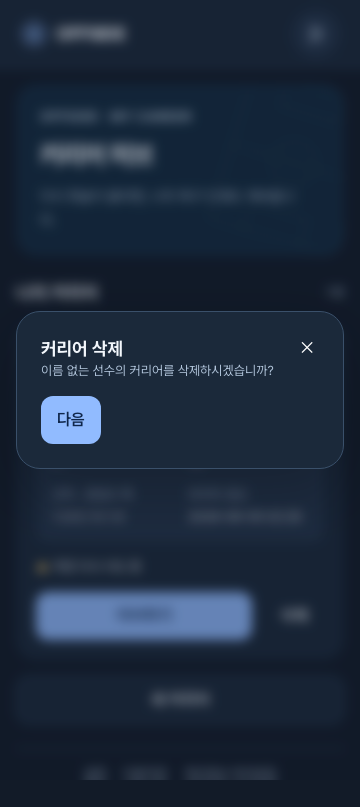

# OFFSIDE 앱형 화면 전환·제스처·모달

2026-09-05, 기존 19개 화면 개편에 이어 적용한 공통 인터랙션 계약이다. 네이티브 앱을 배포하거나 OS 제스처를 대체하는 작업이 아니라, 현재 웹 화면의 전환·터치 피드백을 보강한다. 게임 규칙·저장 데이터·API·스키마·의존성은 바꾸지 않는다.

## 적용 범위

| 영역 | 실제 동작 | 그대로 유지하는 대안 |
|---|---|---|
| 전역 페이지 | 앞으로 오른쪽에서 왼쪽으로 진입, 뒤로 반대 방향. 앱 헤더는 고정 | 링크·다음·뒤로 버튼, 브라우저 탐색 |
| 온보딩 | 안내 본문 좌우 스와이프로 3장을 탐색. 마지막 장에서 더 밀어도 커리어를 생성하지 않음 | 다음·이전 안내·건너뛰기·명시적 KICKOFF |
| 커리어 대시보드 | 본문을 밀어 일정표 → 라커룸 → 전술실 → 휴대폰 → 다이어리 탐색. 양 끝에서 순환하지 않음 | 기존 탭 클릭·키보드 방향키 |
| 능력치 상세 | 본문 왼쪽 가장자리 28px 안에서 오른쪽으로 밀면 해당 커리어 대시보드로 | 기존 뒤로 버튼 |
| 이용약관·개인정보 | 같은 가장자리 제스처로 설정 화면으로 | 기존 게임 메뉴·브라우저 탐색 |
| 공통 Dialog | 열릴 때 배경 블러와 짧은 확대·이동, 닫힐 때 역방향 | Escape·배경 클릭·닫기·기존 포커스 복귀 |

설정, 선수 생성/스타일/확정, 진로, 이벤트, 계약, 훈련, 역할 제안, 경기, 결산 등에는 가장자리 뒤로 가기를 열지 않는다. 특히 설정의 복구·삭제는 React Query 밖에서 진행되는 비동기 작업도 있어 전역 mutation 개수만으로 안전을 보장할 수 없다. 대시보드 스와이프는 **탭 본문에만** 적용하고 위쪽 ‘지금 할 일’ 버튼과 분리한다. 능력치/약관 이외의 전역 뒤로 스와이프는 이후 각 화면의 이탈 계약을 검증한 뒤 opt-in한다.

## 화면 전환 구현

- `AppMotionFrame`은 루트의 안정적인 단일 DOM 레이어다. `Outlet`에 경로별 key를 주거나 이전/새 화면 두 트리를 동시에 렌더링하지 않는다. 커리어 레이아웃·동기화·이벤트 상태를 애니메이션 목적으로 재마운트하지 않는다.
- TanStack Router 공개 `history.subscribe`의 PUSH/REPLACE/BACK/FORWARD/GO 이벤트로 방향을 기록하고, 목적지 loader와 React 커밋이 끝난 공개 `onRendered`에서 재생한다. URL만 먼저 바뀌었을 때 이전 화면을 애니메이션하지 않는다.
- 앞으로 `translateX(24px → 0)`, 뒤로 `-24px → 0`, 220ms `cubic-bezier(.22,1,.36,1)`. 일반 이동은 opacity 1을 유지하여 작은 글자의 대비가 첫 프레임에서도 떨어지지 않도록 한다. REPLACE만 이동 없이 140ms 미세 fade(`.98 → 1`). 명시적 상위 화면 이동과 생성 단계의 이전 버튼도 뒤 방향으로 판정한다.
- 첫 로드와 같은 pathname의 검색/해시 변경에는 재생하지 않는다. 빠른 연속 탐색은 이전 애니메이션을 취소하고, 애니메이션 완료를 기다리느라 입력을 잠그지 않는다.
- Web Animations API 미지원 환경에서는 즉시 전환한다. 정지 상태에 transform/will-change를 남기지 않으며, sticky 하단 행동 영역을 새 스크롤 컨테이너에 가두지 않는다.

## 제스처 인식·안전

- 공통 `SwipeSurface`를 필요한 영역에만 적용한다. 터치·펜의 주 포인터만 인식하며 마우스 드래그는 기존 텍스트 선택으로 둔다.
- 10px 이상 움직이고 가로 이동이 세로보다 명확할 때만 포인터를 캡처한다. 세로 스크롤과 핀치 확대는 브라우저가 처리한다.
- 손가락 이동을 1:1로 반영하고 큰 이동에는 점진 저항을 준다. 취소된 드래그는 현재 위치/속도를 이어받는 감쇠 스프링으로 최대 300ms 안에 복귀한다. 재터치 시 현재 위치에서 다시 잡을 수 있다.
- 폭의 25% 또는 72px 중 큰 거리, 혹은 최소 40px에 최근 속도 0.55px/ms 이상일 때만 확정한다. 역방향으로 돌리거나 멈춘 뒤 놓은 짧은 드래그는 확정하지 않는다.
- 성공하면 드래그 transform을 지우고 화면/탭 전환에 제어를 넘긴다. 숨겨진 게임 버튼 클릭이나 엔진 명령을 호출하지 않는다.
- 입력창·폼·버튼·링크·라디오·탭·가로 스크롤 영역·편집 중 입력·선택된 텍스트·열린 모달에서는 시작하지 않는다. 두 번째 터치, pointercancel, 포인터 캡처 손실, 창 포커스 상실, 비활성화·언마운트 시 취소한다.
- 전역 가장자리 탐색은 인식 중과 놓는 순간 mutation/라우팅/모달 상태를 다시 확인한다. 임의의 `history.back()`이나 사설 `__TSR_index`, 더미 history 항목을 사용하지 않는다.
- 모바일 브라우저가 OS 가장자리 제스처를 우선 처리하면 브라우저 동작에 맡긴다. 이 기능을 유일한 내비게이션 수단으로 삼지 않는다.

## 공통 팝업

기존 커리어 삭제, 복구 코드, 프로필 복구/병합, 연결 해제, 로그아웃, 데이터 삭제, 동기화 충돌은 공통 `DialogContent`를 사용하므로 모두 적용된다. Toast는 모달이 아니므로 배경을 흐리게 하지 않는다. 브라우저 고유 select 팝업도 제어 대상이 아니다.

- scrim: 어두운 중립색 34% + `backdrop-filter: blur(6px)`; 미지원 브라우저는 58% 단색 scrim.
- 창: scale `.97 → 1`, Y `8px → 0`, opacity `0 → 1`, 열림 220ms/닫힘 180ms.
- blur 반경 자체는 애니메이션하지 않는다. Tailwind translate longhand의 중앙 정렬을 유지한다.
- Radix `data-state`와 Presence로 닫힘 애니메이션 종료 후 portal을 제거한다. focus trap, 접근성 title/description, Escape와 트리거 포커스 복귀는 기존 primitive가 담당한다.
- OS 투명도 감소: 블러 제거·76% scrim. 고대비: 블러 제거·82% scrim·명확한 창 테두리.

위 캡처는 격리된 Playwright 컨텍스트의 실제 UI다. 확인창만 열어 촬영했으며 사용자의 커리어를 삭제하지 않았다. 배경의 저장 재시도 표시는 테스트 fixture의 API 503 조건이다.

## 접근성과 한계

OS 또는 앱에서 모션 감소를 켜면 새 화면/모달/드래그의 시각적 이동을 생략한다. 스와이프의 탐색 기능은 유지하고 같은 작업을 버튼·키보드로도 할 수 있다. 문서 루트에 입력 방식을 추적하여 키보드로 실행한 페이지/안내/탭/팝업 애니메이션도 생략한다. 기존 CSS 정책과 동일하게 새 효과는 OS 감소 설정도 우선 존중한다.

별도 네이티브 앱 패키지, PWA 설치, 진동, 화면 방향 고정, 브라우저 자체 navigation 차단은 추가하지 않는다. iOS Safari/Android 실기기의 OS 뒤로 가기·주소창·키보드·safe-area 동작은 실기기 인수 검사가 필요하다.

## 검증

- 단위: 공개 history 방향·안전한 대상 allowlist·WAAPI fallback·감소/키보드 정책·자식 DOM 정체성 유지·중단 정리, 제스처 임계값·속도·스프링·입력 제외/취소.
- 브라우저: 실제 WAAPI 프레임/길이·앞뒤 방향·공통 레이어 보존, OS/앱 감소, 공통 팝업 computed blur/Escape/포커스, 온보딩 마지막 장 무생성, 수평/수직/컨트롤 터치 구분, 약관 가장자리 탐색, 대시보드 탭 스와이프.
- 기존 모바일 프레임·확대·테마·시즌/저장 회귀 suite도 함께 실행한다. 테스트는 격리된 브라우저 컨텍스트와 fixture API에서 진행하며 사용자의 기존 플레이 데이터는 초기화하지 않는다.

### 최종 결과 — 2026-09-05

| 검사 | 결과 |
|---|---|
| 웹 단위·통합 | 40개 파일 / 364개 통과 |
| 공통 UI | 17개 파일 / 82개 통과 |
| 전체 브라우저 suite | 94개 통과 / 6개 기존 환경 전용 조건부 제외, 2.6분 |
| 신규 모션 브라우저 검사 | 위 94개 중 9개. 실제 Chromium touch 입력·Web Animations·computed backdrop blur 검사 |
| 정적·빌드 | 전체 typecheck 9개 task·lint 10개 task, 프로덕션 빌드, diff/포맷 검사 통과 |
| 초기 JS 예산 | 99.30KB gzip / 300KB. lazy chunk를 포함한 전체 앱 크기가 아니라 기존 번들 검사 정의의 초기 합계 |
| 색 대비 | 기존 토큰 30개 조합 통과 + 전환이 켜진 실제 화면의 axe 접근성 검사 통과 |

실제 터치 검사로 자식의 implicit pointer capture가 Surface로 이전될 때 발생하는 `lostpointercapture` 버블링 문제를 발견해 수정하고 회귀 검사를 추가했다. 전체 접근성 검사에서 초기 `.86` fade가 작은 능력치 라벨의 대비를 4.09:1로 낮추는 문제도 확인해 일반 이동의 불투명도를 유지했다. 테스트를 끄거나 판정 기준을 낮추지 않고 전체 suite를 다시 실행한 결과다.

조건부 제외 6개는 실계정 Google 병합 1개, 실제 API 프로필 복구 1개·충돌 2개, 실제 API 서비스 시즌/분석 1개, preview 성능 모드 1개다. 이번 테스트를 위해 새 skip을 추가하지 않았다. iOS/Android 물리 기기와 원격 배포는 이 결과에 포함되지 않는다.

Node 22에서 `pnpm --filter @offside/web test`, `pnpm --filter @offside/ui test`, `E2E_PORT=5226 pnpm --filter @offside/web exec playwright test --workers=2`, `pnpm typecheck`, `pnpm lint`, `pnpm --filter @offside/web build`, `pnpm --filter @offside/web check:bundle`, `pnpm --filter @offside/ui check:contrast`를 실행했다.
