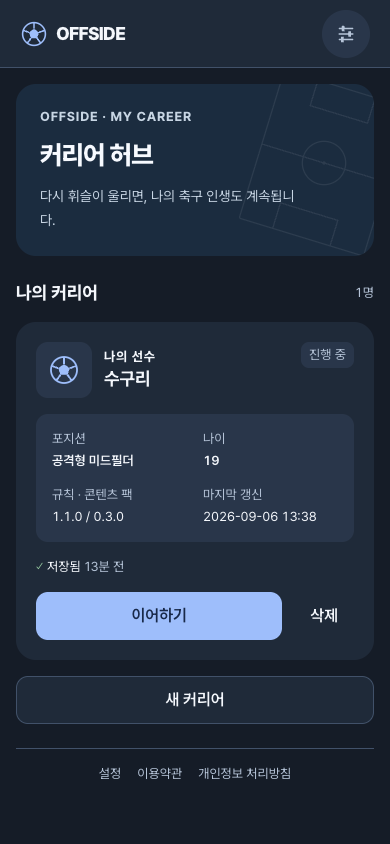
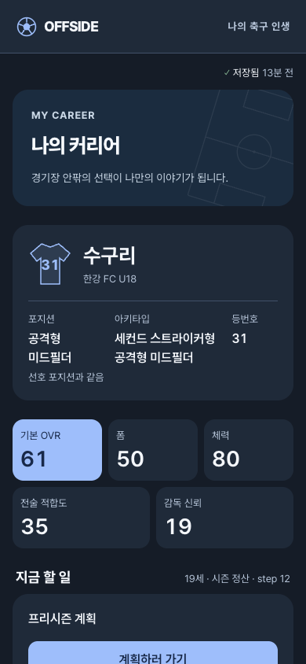
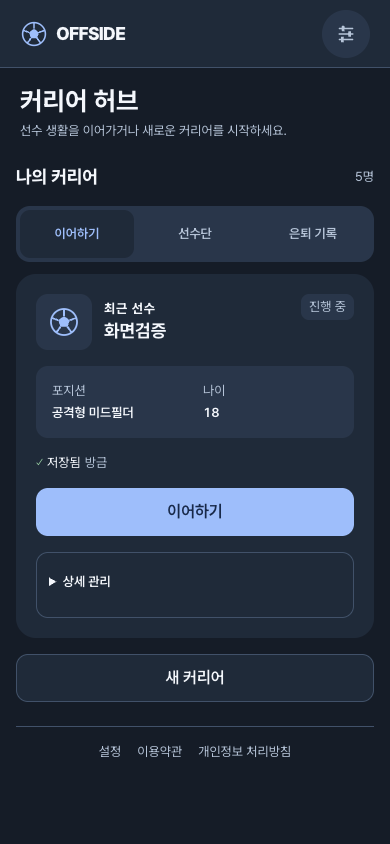
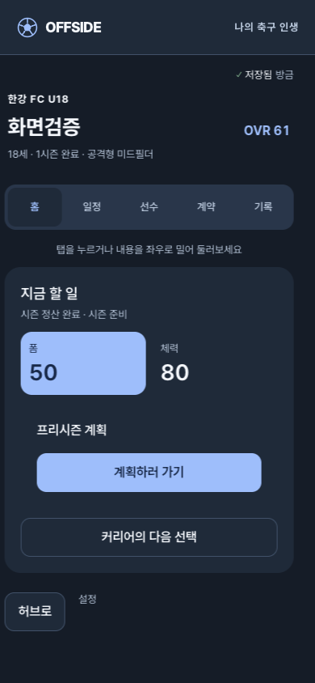
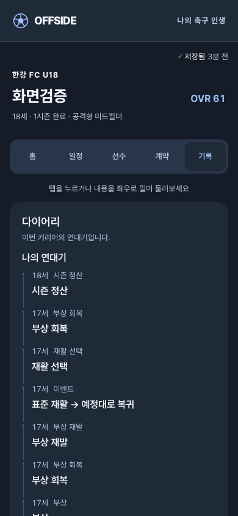

# 커리어 홈과 시간 흐름 UX 개선

작성일: 2026-09-06 · 비교 기준: main `800922e` 및 당시 운영 화면

## 1. 조사 범위와 근거

- [이번 생은 야구다](https://slbcareer.com/)의 실제 허브, 선수단 관리, 은퇴 선수 윤도현의 통산·커리어 화면을 모바일 390 × 844로 확인했다.
- 현재 원작 저장 상태가 은퇴 선수여서 새 인생 시작·초기화는 하지 않았다. 이번 조사에서 현역 시즌 시작부터 엔딩까지 새로 완주했다고 해석하면 안 된다. 과거 플레이는 [첫 플레이 기록](../research/slbcareer-first-run.md), [신규 플레이 기록](../research/slbcareer-fresh-run.md)에 별도로 남아 있다.
- OFFSIDE 운영 허브·선수 홈은 읽기 전용으로 관찰했다. 개선 검증은 로컬 QA 선수로 수행하며 사용자의 운영 선수는 진행·삭제하지 않는다.
- [제작자 Threads](https://www.threads.com/@slbcareer)에서 비로그인으로 공개된 최근 5개 항목을 수집했다. 전체 게시물 수집이 아니며, 관련 계정의 추천 글은 제외했다. 게시 시각은 확인한 UTC를 한국 시간으로 변환했다.

### 제작자 공개 글에서 읽은 방향

| 게시일(KST) | 출처 | 관찰한 내용 / OFFSIDE 적용 판단 |
| --- | --- | --- |
| 09-06 01:23 | [시즌 1 오픈](https://www.threads.com/@slbcareer/post/Dc6YeLKk6Fo) | 새 버전과 시즌 1 시작을 공지했다. 서비스 시즌과 선수의 커리어 시즌은 다른 개념으로 구분해 안내해야 한다. |
| 09-04 02:13 | [팀 소개 이미지 게시물](https://www.threads.com/@slbcareer/post/Dc1UmEDE28W) | 이미지 중심 항목이다. 본 조사에서는 이미지 내부의 상세 기능을 확정 근거로 사용하지 않는다. |
| 09-04 02:13 | [나만의 팀 설명](https://www.threads.com/@slbcareer/post/Dc1UmEQE5Fg) | 여러 선수를 팀으로 연결하는 방향을 소개한다. OFFSIDE의 반복 플레이 허브와 선수 개인 화면을 분리할 이유는 되지만, 이번 범위에 팀 운영 기능을 추가하지 않는다. |
| 09-03 19:56 | [은퇴를 삶의 마무리로](https://www.threads.com/@slbcareer/post/Dc0pb8ik0qF) | 통산 성적, 유사한 레전드, 한 시즌 연장 제안, 개인별 작별 문구를 통해 은퇴의 감정적 완결을 강조한다. OFFSIDE도 나이·시즌·주요 선택을 연결해 축적된 삶을 보이게 하는 것이 중요하다. |
| 09-02 20:45 | [선택과 성장에 따른 다음 장면](https://www.threads.com/@slbcareer/post/DcyKSwqkxxL) | 포지션 선택·성장 능력치 지정·성장에 따른 타입 변화·팀 계획과 성적에 따른 역할 전환을 소개한다. 선택 버튼 수보다 실제 후속 장면과 밸런스를 중시한다. 화면 연출이 시뮬레이션 결과를 바꾸거나 대신해서는 안 된다. |

위 표는 공개 글의 요약이다. 게시자의 주장과 실제 검증된 기능을 동일시하지 않는다.

## 2. 허브와 선수 홈 비교

### 원작 허브

상단에서 현재 기록을 다시 볼지, 새 인생을 시작할지 먼저 결정한다. 선수단·팀 관리는 별도 진입점이며 랭킹·공지·피드백은 아래에 있다. 은퇴한 윤도현이 남아 있는 현재 상태에서는 `윤도현 기록 보기`가 중심 행동이었다. 전체가 무조건 적은 정보라는 뜻보다는 **맨 위의 행동 우선순위가 선명하다**는 것이 핵심이다.

_(공개 저장소 정리로 제거된 캡처: 다른 서비스 화면 또는 개인 연락처가 찍혀 있었다.)_

### 원작 선수 홈

이름·팀·나이·OVR이 있는 작은 선수 헤더 바로 아래에 `통산 기록 / 커리어 / 선수 / 우승 연혁` 탭이 있다. 모바일 화면에서 탭이 약 104–151px 높이에 보였다. 커리어 탭에서는 연도·당시 나이·팀·역할·입단/콜업/이적 같은 사건을 함께 보여준다.

은퇴 기록 입장 시에는 16시즌의 경력을 순차적으로 공개하는 회고 화면도 관찰했다. 이를 선수 등록이나 현역 시즌 시작 애니메이션의 직접 검증으로 간주하지 않는다. 회고의 정확한 재생 시간은 측정하지 않았다.

_(공개 저장소 정리로 제거된 캡처: 다른 서비스 화면 또는 개인 연락처가 찍혀 있었다.)_

### OFFSIDE 기존 화면의 문제

허브 카드에는 플레이에 바로 필요하지 않은 규칙·콘텐츠 버전, 갱신 시각과 삭제 버튼이 주요 행동과 비슷한 비중으로 있었다. 선수 홈에서는 큰 소개 영역, 큰 선수 정보, 상태 지표, 다음 행동 카드가 탭보다 앞서서 390 × 844 첫 화면에 탭 자체가 보이지 않았다.

| Before | After | Why |
| --- | --- | --- |
| 모든 선수와 관리 정보를 한 목록에 표시 | 허브 `이어하기 / 선수단 / 은퇴 기록` 분리, 최근 진행 가능한 선수 우선 | 이번에 할 행동과 보관·관리 행동의 분리 |
| 큰 소개·선수 카드·상태·행동 아래에 탭 | 간결한 선수 헤더 바로 아래 `홈 / 일정 / 선수 / 계약 / 기록` | 첫 화면부터 목적에 맞는 정보로 이동 |
| 버전·갱신 시각·삭제가 기본 노출 | 카드의 상세 관리 안으로 이동 | 삭제는 유지하되 실수 위험과 시각적 경쟁 감소 |
| 나이와 시즌 진행이 여러 카드의 단계 번호로 흩어짐 | 실제 나이·진행 단계와 시즌 이력을 연결 | 숫자가 아니라 경력이 쌓이는 시간으로 이해 |
| 기존 선수 등록은 짧은 연출, 시즌 시작은 성공 후 바로 이동 | 저장 성공 뒤 공통 완료 브리지, 건너뛰기 지원 | 성공과 다음 장면의 경계를 명확히 전달 |
| 기존 역할 이름 `리저브` | `예비 선수`, 출전 명단 진입 경쟁으로 설명 | 축구 용어를 모르는 사용자도 이해, 2군 소속으로 오해 방지 |

## 3. 화면 정보 구조

### SCR-001: 커리어 허브

- `이어하기`: 최근 갱신된 진행 가능 선수 1명. 생성 중인 DRAFT도 포함한다.
- `선수단`: 진행 가능한 선수들. 기존 이어하기와 삭제 경로를 보존한다.
- `은퇴 기록`: RETIRED/ARCHIVED 선수. 빈 상태에서는 아직 기록이 없다고 설명한다.
- 새 커리어 만들기, 서비스 시즌 제한/테스트 안내, 저장 실패 안내는 탭에 관계없이 필요한 위치에 유지한다.
- `?tab=squad`, `?tab=retired`로 새로고침·뒤로가기 시 선택을 복원한다. 알 수 없는 값은 기본 탭으로 정규화한다.
- 게임의 팀 편성 기능을 새로 제공한다는 뜻은 아니다. 여기의 선수단은 사용자의 커리어 목록이다.

### 선수 홈

공통 헤더는 팀·이름·OVR·나이·포지션으로 압축한다. 탭은 첫 화면 안에 표시하고 좁은 화면에서는 가로 넘침을 허용한다.

| 탭 | 포함할 정보 |
| --- | --- |
| 홈 | 현재 시간·진행 상태, 지금 할 다음 결정, 필요한 핵심 상태, 해당 시점의 은퇴/통산 진입 |
| 일정 | 시즌 단계, 경기·주요 구간 및 진행 기록 |
| 선수 | 프로필·상태·관계·전술·역할·상세 능력치 |
| 계약 | 현 계약, 제안·계약 관련 상태와 진입 |
| 기록 | 나이를 명시한 주요 사건 연대기, 시즌 결과, 접힌 상세 진행 로그 |

`?view=schedule|player|contract|records`로 선택한 탭을 보존한다. 계약 성공의 `signed` 알림을 제거할 때도 `view`는 지우지 않는다. 기존 역할·관계·시즌 결과·은퇴·삭제·복구 기능은 정보 위치만 바꾸고 없애지 않는다.

## 4. 시간 흐름의 의미와 한계

현재 엔진은 시즌 정산 시 `state.age + 1`을 저장하며 성장도 정산 절차에서 계산한다. `START_SEASON` 연출이 나이를 증가시키거나 성장 결과를 새로 추첨하지 않는다.

- 나이: 저장된 `state.age`를 유일한 현재 나이로 사용한다.
- 시즌: `season.index`, 완료 시즌 목록, 현재 시즌 단계에 근거한다.
- 과거 사건: 해당 사건에 저장된 나이·시즌 정보로 표시한다.
- 기본 연대기에서는 단순 `STEP_PASSED` 반복을 제외하고 사건 당시 나이를 `17세`처럼 표시한다. 해당 구간의 전체 진행 내역은 상세 로그에 보존한다. 시즌 결과에 `legacy.ageAtStart`가 저장된 경우만 시즌 시작 당시 나이를 결과 링크에 함께 표시한다.
- 프리시즌·첫 계약 전·이적시장·정산 후·은퇴를 가능한 실제 상태로 구분한다.
- 시즌 번호를 달력 연도나 축구 인생 전체의 연차와 무조건 동일시하지 않는다. 원작의 2029년 같은 절대 연도는 현재 저장 모델에 없어 임의로 만들지 않는다.
- 임의의 생일, 매 단계의 나이 증가, 청년/노장 수식어에 따른 미구현 능력 보정은 이번 범위에 넣지 않는다.

이 문서의 홈 개선은 **기존 시간 규칙을 알아보기 쉽게 만드는 UI 개선**이다. 이후 사용자 요청으로 추가된 신규 19세 시작·첫 진로 조정은 [열아홉 킥오프](nineteen-kickoff.md)의 별도 버전 변경으로 다룬다. 나이에 따른 외모·관계 변화, 전체 생애 구간별 새 이벤트, 달력 연도 모델은 별도의 확장 과제로 남는다.

## 5. 등록·시즌 시작 연출 계약

흐름은 `버튼 즉시 반응 → 실제 명령 저장 → 성공 완료 화면 → 실제 다음 화면`이다.

- 선수 등록: 확정 및 최초 진행이 성공한 뒤 완료 연출. 기존 복구 코드 안내와 첫 이야기 경로를 유지한다.
- 시즌 시작: 시즌 시작 및 필요한 자동 역할 확인이 성공한 뒤 완료 연출. 시장 진입·역할 선택 등 실제 다음 상태를 우선한다.
- 공통 완료 화면은 기본 650ms의 짧은 장면이며, `바로 계속`으로 즉시 넘길 수 있다. 내부 진입 효과는 220ms, 공 움직임은 420ms다. 자주 누르는 일반 탭은 기존의 짧은 전환을 사용한다.
- 키보드 입력 및 동작 줄이기 설정에서는 기다리지 않는다.
- 저장 실패를 성공처럼 보여주지 않는다. 연출 중복 클릭으로 명령을 다시 실행하지 않는다. 이탈 시 타이머를 정리한다.
- 랜덤 판정, seed, snapshot, state hash와 성장·계약 규칙은 변경하지 않는다. 연출은 저장된 결과를 보여주는 레이어다.

## 6. 검증과 변경 범위

### 실제 로컬 플레이 확인

새 QA 선수 `화면검증`을 만들고 아카데미 잔류 → 계약 → 빠른 시즌 → 경기 판단 → 부상 재활 → 첫 시즌 결산을 UI로 진행했다. 사용자 운영 선수와 기존 로컬 선수는 삭제하거나 진행하지 않았다.

- 등록 성공 완료 컴포넌트가 나타나고 첫 이벤트로 이동하는 것을 관찰했다.
- 시즌 시작 완료 컴포넌트의 DOM 노출부터 제거까지 약 665ms를 측정했다. 실제 저장 후 시즌 1 홈으로 이동했다. 이 측정치는 한 번의 로컬 관찰값이지 성능 보장 수치가 아니다.
- 시즌 중 17세·시즌 1 → 결산 후 18세·1시즌 완료로 바뀌었다. 다음 시즌 준비와 지난 기록 진입을 보존했다.
- 초기 U18의 내부 `seasonPhase=SETTLEMENT` 때문에 첫 시즌을 마치기도 전에 정산 완료로 보이던 표현을 검증 중 발견해, 완료 시즌 수를 함께 확인하도록 수정했다.
- 선수 탭 선택 후 새로고침 시 `view=records`와 기록 탭이 유지됐다. 허브도 `tab=squad`로 선수단 복귀를 확인했다.
- 390px에서 선수 탭은 화면 상단 228–284px에 표시됐다. 기존에는 844px 첫 화면 아래에 있던 탐색이 위로 올라왔다. 확인한 360/390px 뷰에서 페이지 전체 가로 넘침은 없었다.

### 개선 후 화면

운영 화면과 혼동하지 않도록 아래 이미지는 로컬 QA 선수 화면이다. 서비스 시즌 안내는 API 응답과 상태에 따라 별도로 나타날 수 있다.

### 테스트 원칙

필요한 검증만 수행하며 애니메이션의 매 프레임이나 정확히 650ms일 것을 테스트 계약으로 고정하지 않는다. 중요한 것은 성공 후 노출, 실패 시 미노출, 다음 경로·중복 방지·접근성이다.

19세 확장 전 홈/전환 검증에서 타입 검사·린트·빌드가 통과했다. 커리어 홈 라우트 21개, 시계 3개, 완료 연출 5개 단위 검증을 통과했고, 허브 2개·대시보드 스와이프 1개·등록/시즌 전환 3개 E2E가 통과했다. 접근성 E2E 2개에서 확인한 허브·계약·선수 홈 화면의 axe 위반은 0건이었다. 이후 19세 확장의 검증 결과는 연결 문서에 구분해 기록한다.

### 이번 범위 밖에서 관찰한 문구

기존 팩의 아카데미 잔류 결과에 `프로토타입 종료` 표현이 남아 있고, 일부 유스 계약·데뷔 화면에도 `프로`라는 표현이 사용된다. 실제로는 첫 유스 시즌까지 계속 진행 가능했다. 새 19세 팩의 진로 문구는 별도로 정리하되, 과거 팩 파일은 재생 호환성을 위해 수정하지 않는다. 공통 계약/데뷔 화면의 무대별 명칭은 추가 정리 대상으로 구분한다.

설계에 활용한 스킬: `ego-browser`(실제 화면/공개 게시물 조사), `apple-design`(즉시 반응·방향성·사용자 제어·접근성), `emil-design-eng`(빈도에 따른 연출 강도와 정보 우선순위). 원작의 로고·문구·색상·콘텐츠 자체를 복제하지 않고 정보 구조와 플레이 리듬을 OFFSIDE에 맞게 적용했다.
