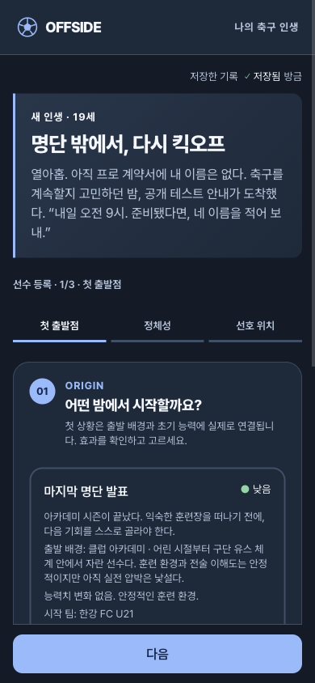
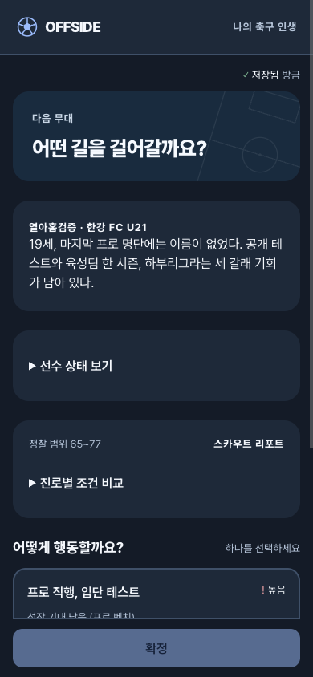
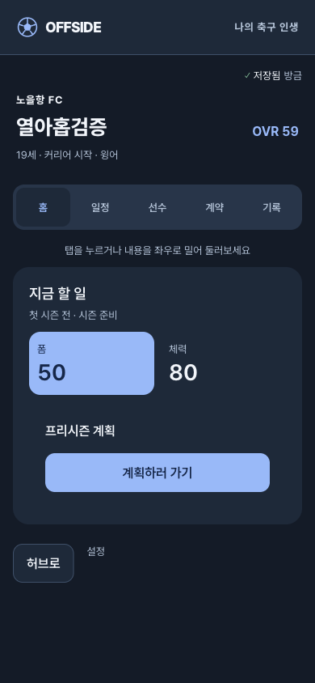

# 열아홉, 명단 밖에서 시작하는 커리어

2026-09-06 사용자 확정: **새 커리어는 19세로 시작하고 관련 진로도 조정한다. 기존 선수는 변경하지 않는다.**

이 문서는 [허브·시간 흐름 개선](career-home-rhythm.md)에 이어 추가된 도입부·선수 생성 설계다.

후속 로컬 개선: 한국 선수 사례 조사 이후 공통 도입을 배경별 사건으로 나눈 [현실적인 출발 상황과 후속 이야기](realistic-career-opening.md)가 `0.4.1`로 추가됐다. 아래는 기존 `0.4.0` 구현과 검증의 기록이며, 기존 선수 보존을 위해 해당 팩을 덮어쓰지 않았다.

## 1. 첨부 영상에서 확인한 것

사용자가 제공한 약 13.3초 화면 녹화를 프레임 단위로 확인했다.

1. 새 인생 시작 확인 대화상자에서 뒤 화면을 어둡게 하고 흐리게 한다.
2. 브랜드 전환 화면을 거쳐 새 선수 생성으로 이동한다.
3. 선수 생성 화면 위에 짧은 세계관 설명이 유지된다. 이름·투타 유형 등을 입력하는 행위가 그 세계관 안의 선수 등록으로 이어진다.

원작의 핵심은 회귀 설정 자체가 아니라 **입력 전에 상황과 감정적 목적을 준다**는 점이다. 홈런볼 사고·회귀·고3 야구선수 설정, 원작의 문구와 시각 자산은 복제하지 않는다.

_(캡처 제거 — 공개 저장소 정리)_

## 2. OFFSIDE의 도입 상황

작업 방향: **명단 밖에서, 다시 킥오프.**

주인공은 아직 프로 계약을 맺지 못했다. 축구를 계속할지 고민하던 중 공개 테스트 안내를 받는다. 이름과 선호 위치를 적어 보내는 순간부터 이번 커리어가 시작된다.

- 국적·성별 선택과 모순되지 않는 공통 상황을 쓴다.
- 모든 선수를 부상·사망·회귀 경험자로 만들지 않는다.
- 테스트 기회와 최종 입단 성공을 혼동하지 않는다. 출전·계약·해외 진출은 보장하지 않는다.
- 신규 규칙은 19세이지만, 기존 생성 중인 17세 선수에도 UI가 적용될 수 있으므로 문구의 나이는 저장된 실제 나이를 사용한다.
- 이미 만든 선수를 지우는 기능이 아니므로 원작의 파괴적 새 인생 확인 대화상자를 불필요하게 추가하지 않는다.

## 3. 첫 선택과 큰 갈림길을 구분한다

### 선수 생성의 첫 선택: 어떤 출발점에 서 있는가

이 선택은 새로운 보정이나 임의 태그가 아니라 기존 `backgroundId`와 1:1로 연결한다. 실제 효과는 선택 카드에서 확인할 수 있고, 선수 확정 시 기존 배경 효과가 적용된다.

| 배경 | 도입 상황의 방향 | 실제 연결 |
| --- | --- | --- |
| 클럽 아카데미 | 체계적으로 훈련했지만 다음 무대의 자리는 보장되지 않았다 | `club-academy`와 그 배경의 기존 초기값 |
| 학교 축구 | 학교팀의 경험을 다음 계약으로 이어가야 한다 | `school`의 체력·몸싸움 중심 장단점 |
| 동네 클럽 | 익숙한 동네 경기장을 넘어 정식 기회에 도전한다 | `street`의 기술·민첩성 중심 장단점 |

### 생성 후 실제 진로 결정

큰 갈림길은 이름 입력 단계에서 결과를 확정하는 대신, 선수 확정 후의 실제 PATH 이벤트로 연결한다.

| 진로 | 플레이상의 의미 |
| --- | --- |
| 프로 입단 테스트 | 높은 무대를 노리되 평가 결과에 따라 제안이 달라짐 |
| 육성팀에서 한 시즌 | 성인 진입 전 훈련·출전 경험을 더 쌓는 선택. 19세와 맞지 않는 U18 표현 제거 |
| 하부리그 도전 | 리그 명성보다 출전 기회를 중시하는 선택 |

새로운 대학 시스템·새 해외 진출 보장·선택 즉시 능력 폭증은 이번 범위가 아니다. 기존 제안·경기·성장 엔진이 실제 결과를 결정하며 화면의 서사는 이를 설명한다.

## 4. 생성 화면 흐름

`새 커리어 → 도입 상황·배경 → 이름/성별/국적/주발 → 선호 위치 → 스타일 → 선수 카드 확인 → 저장 성공 연출 → 첫 이야기·진로 결정`

- 도입 설명은 첫 화면에 충분히, 다음 입력에서는 짧게 남긴다.
- 선택한 배경이 왜 현재 선수의 출발점인지 읽을 수 있게 한다.
- 기존 임시 입력 보존·이전 이동·새로고침 복구를 유지한다.
- 하나의 새 커리어당 DRAFT 생성은 한 번만 한다.
- 연출은 저장 성공과 실제 페이지 이동에 붙인다. 긴 가짜 로딩이나 랜덤 결과 재추첨은 하지 않는다.
- 키보드·동작 줄이기·건너뛰기 경로를 유지한다.

## 5. 버전과 저장 호환성

기존 생성 로직의 17을 전역적으로 19로 바꾸면 과거 `CREATE_CAREER` 재생 결과와 해시가 달라진다. 그래서 신규 룰셋 `1.2.0`과 콘텐츠 팩 `0.4.0`으로 분리한다.

- 기존 룰셋/팩 파일은 수정하지 않는다. 초기 나이 설정이 없는 기존 규칙은 계속 17세로 생성·재생된다.
- 신규 룰셋은 19세를 사용하고, 시작 팀·육성 경로·PATH의 나이 조건을 일치시킨다.
- 새 커리어 생성은 서버 서비스 시즌의 룰셋/팩 쌍을 따른다. 클라이언트 기본값만 바꾸고 19세가 적용됐다고 판단하지 않는다.
- 서버가 아직 이전 쌍을 반환하면 새 버전 승격 전 상태다. 버전 등록, manifest/checksum, 서버 검증 및 활성 서비스 시즌 변경을 분리해서 검증한다.
- 기존 선수의 현재 나이·과거 사건·계약·점수·저장 해시를 일괄 변환하지 않는다.
- 종료 나이 규칙을 유지할 경우 신규 선수의 가능 시즌 수가 이전보다 약 두 시즌 줄 수 있다. 새 기준의 점수 분포는 이전 시작 나이와 동일하다고 단정하지 않는다.
- 신규 쌍에서도 Legacy `1.1.0`의 점수·등급·엔딩 계산을 유지한다. 단, 검증된 19세 시작 기준 모집단이 없으므로 상대 백분위는 `percentileHidden=true`로 숨긴다. 17세 표본을 19세 실측 표본인 것처럼 이름만 바꿔 발표하지 않는다. 기존 `1.1.0/0.3.0`의 기준 모집단은 보존한다.

### 활성화와 배포 경계

서버에 이미 등록된 선수의 후속 동기화는 생성 당시 버전을 사용하므로 현재 시즌 manifest 변경과 분리되어 있다. 그러나 **오프라인에서 생성돼 아직 서버에 한 번도 등록되지 않은 선수**는 첫 동기화에서 서비스 시즌 manifest를 검사한다. 따라서 운영 `svc_season_1`의 버전을 단순 덮어쓰면 이 경로가 거절될 수 있다. 이번 구현에서는 신규 쌍의 등록과 별도 테스트 서비스 시즌을 준비하고, 운영 행·사용자 선수·배포 포인터는 변경하지 않는다.

운영 승격 시에는 같은 시즌 1 안의 버전 변경을 어떤 서비스 시즌 식별자로 관리할지, 이전 선수의 동기화를 어떻게 계속 허용할지 release 절차와 함께 확인해야 한다. 클라이언트 배포만으로 모든 새 선수가 19세가 되는 것은 아니다. 서비스 시즌 API가 신규 쌍을 반환하는지까지 확인해야 활성화 완료다.

## 6. 필요한 최소 검증

1. 기존 버전의 17세 생성과 재생 결과 유지.
2. 신규 버전의 19세 생성, 세 진로 선택 도달, 첫 시즌 후 20세.
3. 첫 상황 선택이 실제 배경·초기값에 반영됨.
4. 생성 중 새로고침·이전 이동·중복 클릭·키보드 경로.
5. 서버가 신규 쌍을 허용하고 기존 선수 동기화도 계속 허용함.
6. 도입·선수 카드·허브·기록의 나이가 같은 저장 상태를 표현함.

## 7. 로컬 검증 환경

- `apps/api/seeds/bootstrap-nineteen.sql`: `svc_nineteen_qa`, PRESEASON, 테스트 시즌, 종료일 미정, `1.2.0/0.4.0`. 동일 ID가 있으면 덮어쓰지 않는 INSERT-only 방식이다.
- 로컬 DB에 미적용 상태였던 기존 `0005_adorable_tombstone.sql`(종료일 nullable 전환)을 적용한 후 위 행만 추가했다. 기존 날짜 값과 선수 기록은 보존했다.
- 별도 API `http://localhost:8796`은 `ACTIVE_SERVICE_SEASON_ID=svc_nineteen_qa`, 웹 `http://localhost:5199`는 해당 API를 사용한다. 기존 5173/8787 서버의 활성 시즌 포인터는 변경하지 않았다.
- 실제 API 응답에서 `19세 커리어 QA`, `1.2.0/0.4.0`, `endsAt:null`, `isTest:true`를 확인한 후 UI에서 새 19세 선수를 생성했다.

### 실제 화면과 검증 결과

직접 브라우저에서 QA 선수 `열아홉검증`을 생성하고 배경·정체성·선호 위치·스타일을 입력했다. 생성 도중 새로고침 후 작성 위치와 입력값이 복원됐으며, 확정 뒤 첫 PATH → 하부리그 선택 → 입단 테스트 → 3부 노을항 FC 계약 → 19세 선수 홈까지 확인했다. 이 직접 플레이는 첫 시즌 완주와 구분한다.

| 검증 | 결과 |
| --- | --- |
| 신규 `1.2.0/0.4.0` 브라우저 E2E | 19세 도입 → 첫 PATH → 계약 → 빠른 시즌 → 첫 결산 → 20세 홈, 1개 통과. 서비스 시즌 API는 테스트 응답이며 게임 명령은 실제 클라이언트 엔진 실행 |
| 생성·홈·시계·연출 관련 단위 검증 | 6개 파일, 84개 통과 |
| 도메인 생성·기존 동작 검증 | `simulate.test.ts` 102개 통과, 이전 버전 17세와 신규 설정 19세 포함 |
| 신규 팩 핵심 검증 | 3개 통과: 등록/호환 정보, 실제 초기 단계 12에서 첫 PATH 우선, 세 진로의 태그/후속 정의 연결 |
| 은퇴 artifact 연결 | 기존 쌍과 신규 쌍 테스트 6개 통과 |
| API 은퇴 저장·복구 | 10개 통과, 신규 쌍의 Legacy 1.1·백분위 숨김 포함. 별도로 기존 선수의 manifest 변경 후 동기화 검증 통과 |
| 키보드 전용 진행 | 생성 → 계약 → 홈/탭 → 삭제 대화상자까지 기존 E2E 1개 통과 |
| 정적 검사 | Web/API 타입 검사, Web/Content 및 변경 API 테스트 린트, Web 빌드, diff 공백 검사 통과 |
| 파일 무결성 | 전체 콘텐츠 manifest/checksum 검사 통과, 경고 0. 이전 룰셋/팩 디렉터리 변경 없음 |

테스트는 신규 콘텐츠에 기존의 500시드 × 2시즌 검증을 복제하지 않고 핵심 3개와 브라우저 한 시즌 검증으로 제한했다. 세 진로 모두를 장기 완주하거나 새 시작 나이의 전체 엔딩 분포를 검증했다는 뜻은 아니다. 빌드에는 기존 라우트 테스트 파일 제외 안내 및 큰 청크 경고가 남아 있다.

발견·수정한 핵심 결함은 신규 생성 직후 일반 관계 이벤트가 첫 진로와 경쟁하던 점이다. `0.4.0`에서 첫 계약 전·완료 시즌 0의 유효 PATH가 존재하면 이를 우선하며, 지정된 후속 이벤트는 기존대로 먼저 처리한다. 과거 팩의 추첨 순서는 변경하지 않았다.

현재 결과는 로컬 브랜치 `feat/career-home-rhythm`의 구현·검증 상태다. 커밋/PR/운영 배포 및 운영 서비스 시즌 승격은 이번 턴에서 실행하지 않았다.
