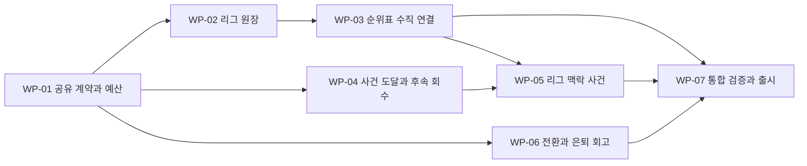

# 20. 리그 맥락·선택의 후속 결과·은퇴 회고 작업 계획

- 작성일: 2026-09-14 / 갱신일: 2026-09-15 / 상태: 구현 PR 4개 생성, 최신 main 재통합·검증 진행 중
- 기준: main `cb6d2995c127a225a0cb926830ed47d808424ddd`
- 제품: [PRD](../product/career-world-prd.md) / 설계: [ADR-011 제안](../adr/ADR-011-league-ledger-and-career-feedback.md)
- 기존 [고도화 계획](16-advancement-execution-plan.md)·[Phase 5 통합](19-phase5-runtime-integration.md)을 재시작하지 않는다. 아래는 현재 구현 이후의 차이만 다룬다.

## 2026-09-15 재통합 결정

9/14의 검증은 아래에 명시한 당시 SHA에만 적용한다. 이후 main에 성장·은퇴 정책과 Legacy 1.2.0, 커리어 헤더 4탭이 추가되어 #221 → #220 → #222 → #224 순서로 다시 통합한다. #224는 #222를 부모로 하는 PR이며 부모 병합 후 main 기준으로 재검증한다.

- 사용자는 새 리그 룰셋 `1.7.0`에 현재 main `1.6.1`의 성장·은퇴 밸런스를 계승하도록 확정했다. `growthRules`·`retirementRules`는 그대로 유지하고 리그 원장 규칙을 추가한다. 리그 일정·결과가 달라지므로 두 룰셋 간 hash나 성과 분포의 동일성을 요구하지 않는다.
- 이미 등록된 팩 `0.6.2`의 내용·호환 목록은 보존한다. 리그용 새 팩 `0.6.3`은 기존 콘텐츠와 동일한 내용을 사용하고 `1.7.0` 호환을 등록한다. 새 조합의 Legacy 정책은 `1.2.0`이며 기존 조합과 구버전 golden은 유지한다.
- 화면은 main의 시즌·커리어·선수·우승 연혁 4탭과 고정 헤더를 보존한다. 선택 기록과 현재 리그 맥락을 새 정보 구조에 연결하고, 은퇴 회고는 저장된 결과의 표현으로 유지한다.
- 실제 코드·충돌 해결은 sol 워커, 계약·리뷰·머지 조율은 Codex, 성장·은퇴 호환 독립 리뷰와 회귀 검증·CI 상태·공유 tracking 문서는 Claude가 맡는다. 무거운 검증은 한 실행자에게 순서대로 배정한다.
- 새 통합 SHA에서 구버전 회귀, 새 버전 결정론, 저장·화면 계약을 확인한다. 이전 통과 기록을 최신 main의 통과로 간주하지 않는다. 운영 배포와 서비스 시즌 ACTIVE 승격은 이 재통합 작업에 포함하지 않는다.

## Phase 0. 조사 결과와 허용 패턴

조사는 sol 에이전트 3명이 엔진·문서/버전·화면으로 나눠 수행했고 오케스트레이터가 통합했다. 다음 경로·행은 기준 SHA의 위치다. 구현자는 착수 시 해당 소스를 다시 읽고 원격 main 변경을 확인한다.

| 근거 | 확인한 실제 API/계약 | 사용 방법·주의 |
|---|---|---|
| `packages/domain/src/ruleset.ts:40–72` | `Team`, `League` | 기존 ID/리그/전력/팀 수/홈원정 계약을 복사 출발점으로 사용 |
| `packages/domain/src/schedule.ts:82–184` | `buildLeagueRounds`, `buildSchedule(ruleset, team): ScheduleEntry[]` | 현재는 내 일정만 생성. 신규 전 리그 대진 투영과 구버전 분기를 분리 |
| `packages/domain/src/match.ts:28–57,270` | `PlayMatchInput`, `playMatch(input): PlayMatchResult` | 내 경기 정본 유지. 선수 통계까지 결합된 함수를 타팀전용으로 무조건 재사용하지 않음 |
| `packages/domain/src/simulate.ts:706–829` | `createStepMatchWiring`, `playStepMatches`, `matchRngState` | 별도 RNG 및 step 경기 반영 패턴; pending 재개와 컵을 보존 |
| `packages/domain/src/season-stats.ts:173–208,233–262` | `computeLeaguePosition(...)`, `applyPlayedMatch(...)` | 기대승점 근사라는 사실 확인. 신규 버전의 모든 position 소비자 교체 대상 |
| `packages/domain/src/types.ts:473–520,589–626,696–744` | `CompetitionRecord`, `ScheduleEntry`, `MatchRecord`, `FootballSeason`, `SeasonResult/Summary` | 기존 내 팀 기록 의미를 유지; 새 optional 계약 필요 |
| `packages/domain/src/settlement.ts:34–49,99–141` | `buildSeasonResult`, `hashSeasonResult` | 최종 표·효과는 hash 전에 고정 |
| `packages/contracts/src/career-state.ts:329–340,599–641,663–737` | strict 저장 스키마 | domain 추가와 원자적으로 정합; absent 구버전 허용 |
| `apps/web/src/shared/season-schedule.ts:17–96` | `buildScheduleRows(season, ruleset, overrides)` | 순수 표시 모델 패턴, 표 안에서 결과 계산 금지 |
| `apps/web/src/routes/career.$careerId.index.tsx:364–388,886–964` | 대회 요약·일정 탭 | 기존 화면 안에 리그 정보 진입 추가 |
| `apps/web/src/routes/career.$careerId.season-result.tsx:319–380` | 최종 순위 구간 표시 | 실제 승강격 미지원 문구를 숨기지 않음 |
| [시간 모델](11-time-model-and-pacing.md) RULE-TIME-002~004 | FAST/12-step/결정 예산 | 시즌 모드 선택 UI 복원 금지, 미노출 이벤트 RNG 소비 금지 |
| [모션 명세](13-visual-design-system.md) DSN-MOT-001 | 확정값 우선, 800ms 상한, 감소 설정 | 새 애니메이션 패키지·명령을 먼저 만들지 않음 |
| `apps/web/src/shared/game-presentation.tsx:94–155` | `GameResultReveal({children, fast?, announcement, durationMs?, onSkip?, announcementTestId?, skippable?})` | 기존 결과 공개·감소 설정·키보드·skip 재사용 |
| `apps/web/src/shared/countup.tsx:15–97` | `CountUp({value,label,format?,durationMs?,onSkip?})` | 이미 있는 카운트업 재사용, null/0/최종 접근성 값 처리 유지 |
| `apps/web/src/shared/legacy-score-card.tsx:5–125` | `LegacyScoreCard({result,onSourceClick?})` | 기존 /100 점수·상위 기여 3개·source 링크·최고 순간 재사용 |
| [은퇴 통합](19-phase5-runtime-integration.md) | RETIRE→Archive→Legacy/연대기 | 기존 은퇴·점수 엔진 재개발 대신 표현·근거 조회 보강 |

신뢰도: 타팀 결과 부재·근사 순위·기존 저장 의미는 코드 직접 확인으로 높음. 새 원장의 최대 크기·분포·실행 시간은 아직 실측하지 않았고 구현 전 게이트다. 원작은 한 커리어 관찰이므로 사건 확률을 규칙 값으로 복사할 근거가 없다.

## 실행 원칙과 의존성

WP 식별자는 문서 내부 작업 묶음이며 실제 T-ID를 예약하지 않는다. 착수 시 tracking 보드의 기존 작업(T-7-021 등)과 겹침을 확인해 별도 brief에 매핑한다. root는 오케스트레이션·계약·리뷰를 맡고 실제 코드는 sol이 전용 worktree에서 구현한다.

첫 사용자 제공 범위는 WP-01→02→03이다. WP-04/06은 계약 확정 뒤 UI/콘텐츠의 독립 영역부터 병행할 수 있지만 같은 domain 타입·ruleset·공통 화면은 한 구현 소유자가 통합한다. WP-05는 실제 순위 원장이 없으면 시작하지 않는다. 전체 기능을 한 거대 PR로 묶지 않고 각 수직 슬라이스가 자체적으로 검증되게 한다.

### 2026-09-14 구현 인계

사용자의 병렬 구현 지시에 따라 Orca Run `run_73df4d69d1a6`에서 sol 작업자 세 명에게 별도 worktree를 배정했다. 구현 시작 기준은 `origin/main` `51fb80c2f7dfcc32d120fff8884588d2d01e66c3`이며 위 Phase 0의 조사 기준과 구분한다. root는 계약 검토·작업 조율·독립 리뷰·PR 확인을 맡는다.

| 작업 | WP / 코드 소유 범위 | 의존성과 보고 |
|---|---|---|
| T-7-022 | WP-01/02/03: domain·contracts·content·저장·리그 표 수직 연결 | [PR #222](https://github.com/tasddc1226/offside-football-simulator/pull/222), 독립 리뷰·자연 브라우저·로컬 검증 완료, Ready |
| T-7-023 | WP-04: 기존 저장 사실 기반 면담·부상·임대 후속 화면 | [PR #221](https://github.com/tasddc1226/offside-football-simulator/pull/221), 검토 완료·Ready; 인과관계 기록 gap은 아래와 같이 유지 |
| T-7-024 | WP-06: 은퇴 회고·마일스톤 표시 | [PR #220](https://github.com/tasddc1226/offside-football-simulator/pull/220), 검토 완료·Ready; 서버 동기화는 브라우저 검증 범위에서 미확인 |
| Career World WP-05 | 실제 리그 맥락의 읽기 전용 요약 | [PR #224](https://github.com/tasddc1226/offside-football-simulator/pull/224), #222를 부모로 하는 PR; 독립 리뷰·자연 브라우저·관련 E2E 2개·빌드 완료 |
| WP-07 검증 | 각 PR의 독립 리뷰 및 충돌·통합 검증 | 네 PR 최종 조합에 충돌·제품 코드 blocker 없음; 아래 정확한 검증 tree 참조 |

WP-01의 구현 후보 계약은 최대 16팀, circle 홈·원정/BYE, 시즌 시작 RNG 상태 복사본에서 fixture별 난수 파생, 라운드 단위 원자 반영, `SeasonResult`에 최종 표 단일 보존이다. 새 버전 후보 `1.7.0`/`0.6.2`는 기존 버전을 보존하고 서비스 시즌을 활성화하지 않는다. 이 후보로 구현을 시작하되 크기·성능·구버전 재생 실측 전에는 ADR의 데이터 모델 게이트 통과로 간주하지 않는다.

18:22 확인한 `origin/main` `67a18cd58ff6a630f6b4e84a1e107db96b7a597f`에서 T-7-025가 별도 성장 밸런스 작업에 배정됐다. 이 Run의 기존 T-7-025 브랜치·Task는 추적을 위해 유지하되, 제품 작업명은 Career World WP-05, brief는 `career-world-wp05.md`로 구분한다. 기존 T-7-025 문서는 수정하지 않는다. 아래 T-7-025 첫 슬라이스 설명도 이 Run의 WP-05를 뜻한다.

이후 main `494d389d3c3903120570790da88e5a150fb5a0c8`에서 별도 밸런스 작업은 T-7-030/031로 재번호됐다. 이 Run의 WP-05 문서명은 그대로 유지했다.

리그 저장 후보는 활성 fixture를 ordinal/스코어 tuple로, 최종 표를 순위·팀 ID·팀명·경기·승무패·득실·승점 11값 tuple로 저장하며 표시 시 순수 adapter로 펼친다. 동일 40개 FAST 커리어의 20시즌 재측정에서 최대 state는 229,715 bytes, 모델링한 미동기화 PUT는 363,635 bytes였다. 행동 CSV 지표는 일치했고 저장 표현 변경으로 state hash는 변경됐다. 실제 SDK PUT·서버 재생·WebWorker 시간의 증거와는 구분한다. ADR은 출시 게이트가 모두 확인될 때까지 제안 상태를 유지한다.

최종 통합 입력은 #222 `fc00e50e8de49721ee1d6e44f5b548bb68b7ea69`, #224 `4380c71016ff37e749c0f258a3091813ea86ba4e`, #221 `9bd7f3a6f27009bac2946fda4416c65b298fdf78`, #220 `a9495021cc1c46df0aa1732e5c6697895d254d3c`다. 독립 sol의 임시 통합 commit은 `95524d2b27d27d6482c1d9f72f7c2de075e8243b`, tree는 `02bb33d304ec2a923864c34d96f00a572c7c2e4d`이며 main에 병합하지 않았다. 충돌 없이 web lint/typecheck·대시보드/은퇴 36개, 계약/엔진 lint/typecheck·계약 51개·decode/import/load 26개가 통과했다. 이후 테스트 추가와 문서 반영은 제품 코드 불변을 확인해 전체 검사를 반복하지 않았다.

실제 1.7 시즌 결산의 `EngineClient.buildSyncBody`를 `createSyncClient` fake transport로 전달해 PUT 본문 동일성·스키마·1MiB 제한을 기존 테스트에서 확인했다. 자연 브라우저에서는 시즌 결산→다음 시즌→과거 14팀 표, 모바일 스크롤·reload를 확인했다. 이는 20시즌 실제 SDK 최대 요청, 운영 API 수신/재생, WebWorker 장기 성능을 증명하지 않는다. 전체 테스트 시간 초과와 중단된 광범위 E2E의 미확정 실패는 각 PR에 그대로 기록했으며, 관련 검사의 통과를 전체 suite 통과로 표현하지 않는다. 이 Run의 완료 범위는 구현·리뷰·PR 인계이며 운영 활성화는 포함하지 않는다.

첫 WP-04 조사는 면담 이후 소비된 제안과 실제 계약 사이의 인과관계, 임대 복귀 이전 원소속 역할·평가 근거가 현재 저장에서 완전히 복원되지 않음을 확인했다. 화면은 이 관계를 추측하지 않으며 후속 계약 보완 여부는 T-7-025 범위 확정에 포함한다. 전체 무거운 검사 체인은 한 작업자씩 실행한다. 이번 인계의 산출물은 범위별 검증된 PR이며 merge·운영 활성화는 별도 단계다.

## Phase 1. 리그 계약 — WP-01 / 선행 게이트

- 대상: FR-CW-001~005, TEST-CW-001~003.
- 산출물: ADR-011 채택/수정, 신규 저장/표시 타입 계약, 버전·일정·난수·용량 예산, 정상/예외 상태 표.
- 구현 준비: 위 Team/League, schedule, matchRngState, strict schema 패턴을 읽고 신규 필드와 가드 이름을 확정한다. 문서에 제안된 `LeagueSeasonLedger` 등을 이미 존재하는 API로 호출하지 않는다.
- 확정할 경계: 명명/가상 팀의 고정 ID, 짝수/홀수 팀의 bye, 전체 홈원정 pairing, 라운드→step, 내 경기 스코어와 리그 결과 조인, 컵 분리, pending 전후 commit, 휴식 복무·유스·FA·임대 복귀의 지원 상태, 결산 후 최소 보존.
- 검증: 지원 리그 전부의 팀 수·예정 경기 수를 산출하고 최악 크기 예산을 계산한다. actual Snapshot 및 전체 PUT body 크기를 기존 제한과 대조할 실측 방법을 정의한다. 새로운 순위가 DECIDER·우승·Legacy에 미치는 소비자 목록을 만든다.
- 금지: 임의 타팀 승점 생성, 새 실시간 서버, 기존 버전 덮어쓰기, 표부터 구현해 근사 데이터를 사실로 노출.
- 완료: 코드 작업자가 추가 제품 판단 없이 정상 1시즌과 예외 경계를 구현할 수 있는 계약 및 수용 기준이 있다. 기술 게이트 미통과는 계약 미완료로 남긴다.

## Phase 2. 원장과 저장 — WP-02

- 선행: WP-01 / 주 소유: domain·contracts·content sol 한 명.
- 패턴: `buildSchedule`, `playStepMatches`, `applyPlayedMatch`, `buildSeasonResult`의 기존 명령/저장 구조를 복사해 새 버전 분기를 연결한다.
- 구현: 전체 소속 리그 대진→내 일정 투영, 타팀용 fixture 파생 RNG와 최소 스코어, 원장 집계와 stable tie-break, 내 팀 기록 projection, 최종 표의 hash 전 동결. 새 ruleset/호환 팩/loader/retirement registry를 한 계약으로 연결한다.
- 검증: 각 팀 홈원정 상대 횟수, 한 라운드 중복 출전 없음, bye 처리, `P=W+D+L`, `PTS=3W+D`, 리그 총 승=총 패, 총 득점=총 실점, `sum(팀별 drawn)=2×무승부 fixture 수`. 무승부 fixture 자체의 개수는 홀수여도 정상이다. 내 경기·선수 득점·도움 등 기존 불변식 유지. 타팀 조회/계산 순서 변화가 내 RNG를 소모하지 않음. 중복 요청·저장 복구·fork·서버 replay 동일 hash.
- 용량/성능: 1시즌/20시즌·최대 팀 수·최대 허용 로그의 실제 직렬화 크기와 Worker 시간 측정. state≤262,144 bytes 및 commands 포함 전체 PUT≤1,048,576 bytes를 각각 검증하고 결과를 PR에 기재한다. 제한 출처는 `packages/contracts/src/headers.ts:19–23`, `packages/contracts/src/snapshot-size.test.ts:62–75,187–210`, `apps/api/src/middleware/bodyGuard.ts:16–35`다.
- 금지: old golden을 새 값으로 재기록, 내 경기 결과 두 번 추첨, 컵 포함 순위, 표와 competitions의 두 정본, 과거 표 소급 생성.
- 완료: 기존 저장 전체 검증과 새 원장 불변식이 통과하며 화면 없이도 명령 재생으로 설명 가능한 한 시즌 결과가 생성된다.

## Phase 3. 팀 순위표 — WP-03 / 첫 제공 묶음

- 선행: WP-02 / 대상: FR-CW-001~005/012.
- 패턴: `buildScheduleRows`의 view model, 기존 대시보드 일정 탭, season-result query 기반 과거 조회를 재사용한다.
- 구현: 현재 리그 표·내 팀 강조·위 팀과 승점 차·갱신 라운드, 상세 득실, 결산 최종 표와 다음 시즌 이후 과거 조회. 별도 라우트 없이 기존 정보 구조로 가능한지 우선 적용한다.
- 상태: 경기 전, 미지원 구버전, 순위 없음, pending 마지막 확정값, 다른 리그로 이적한 뒤 과거 표, 데이터 로딩/오류를 구분한다.
- 검증: 360px 표 읽기·키보드·스크린리더 머리글·수평 스크롤, 원장/내 팀 경기/결산 일치, 새로고침·두 탭·직접 과거 조회. 유효한 승강 구간만 노출하고 실제 이동 미지원 안내 확인.
- 금지: React 안의 승점/난수 판정, 미지원 기록의 0점 표, 우승 경쟁/대륙 진출을 추정한 문구.
- 완료: 실제 신규 커리어에서 한 시즌→다음 시즌→과거 순위 조회가 가능하고 구버전 화면도 정상이다.

## Phase 4. 선택의 후속 이야기 — WP-04/05

### WP-04: 기존 사건의 실제 도달성과 회수

- 선행: WP-01. FR-CW-006~008. 기존 T-7-018 면담·market preference 종료 상태, 부상/복귀/대표팀·임대 기록에서 출발한다.
- 산출물: 대표 서사 3개(면담→탐색/계약, 부상→선택→복귀, 임대→출전→복귀 평가)의 조건/선택/효과/source ID/후속 장면/만료·취소 표.
- 먼저 기존 FAST 도달 경로를 증명한다. 일반 EVENT 데이터만 추가하지 않는다. 신규 노출을 도입하면 선택 예산·필수 pending 우선순위·동시 자격·쿨다운·미노출 RNG 불소비 계약을 작성한다.
- 검증: 각 서사 고정 seed 실제 명령/브라우저 도달, 수락/거절/취소/무효화와 시즌 경계, 실제 source ID 회수. 확률은 새 규칙과 분포 증거로 설명하고 원작 단일 관찰에서 숫자를 추정하지 않는다.
- 금지: 런타임 생성형 대사, 없는 선호 성공/선택/관계 이력, promise breach와 추가 불이익 중복, 새 이벤트를 배포했다는 이유만으로 노출 완료 처리.

### WP-05: 리그 경쟁 맥락 연결

- 선행: WP-03+04. 순위표의 마지막 확정 라운드에서 우승 경쟁·하위권 상황과 감독 응답의 문맥을 만든다.
- 첫 슬라이스는 사실 요약부터 제공하고, 신뢰·사기·사건 가중치를 바꾸는 정책은 새 버전 계약과 분포 검증 이후다.
- T-7-025의 첫 구현은 마지막 확정 라운드의 순위·승점 차를 선택/계약 화면의 현재 팀 상황으로 설명하는 읽기 전용 범위다. 면담 당시 순위가 저장되지 않았다면 현재 순위를 당시 응답의 원인으로 연결하지 않는다. 면담→계약 인과 ID와 임대 복귀 역할 snapshot 제안은 이 슬라이스의 core 변경에 포함하지 않는다.
- 검증: 표시 시점의 리그/시즌/round/source가 같은지, 전 시즌 순위를 현 시즌 사건에 사용하지 않는지, 경기 수 불균형/동점에서 과장된 단정이 없는지, 라운드 진행 후 종료/변경된 맥락이 정리되는지.
- 완료: 사용자에게 선택 이유가 더 잘 설명되며, 순위 UI와 다른 기준으로 만든 위기/우승 사건이 없다.

## Phase 5. 전환과 은퇴 회고 — WP-06

- 선행: WP-01. FR-CW-009~013. 리그 전용 회고 항목만 WP-03에 의존하며 나머지는 기존 Archive로 독립 준비할 수 있다.
- 패턴: DSN-MOT-001, `GameResultReveal`, `CountUp`, `LegacyScoreCard`, 기존 입단 결과 선저장/skip, [은퇴 런타임](19-phase5-runtime-integration.md)의 RETIRE·Legacy·timeline 조회를 복사한다. 동일 역할 컴포넌트를 새로 만들지 않는다.
- 구현: 실제 처리/완료 상태 피드백, 장기 사건의 연도/구간 표시, 제한적인 800ms 이하 성과 강조. 은퇴 후 선택적 `커리어 돌아보기`에서 source가 있는 대표 장면 3~5개(부족하면 실제 개수)→기존 Legacy 근거→최종 기록을 안내하며 단계/전체 진행을 표시한다. 전체 skip·최종 바로 보기·기존 네 화면 직접 이동·다시 보기를 함께 유지한다. 회고 진행 위치는 표현 상태로 두고 게임 상태/hash를 바꾸지 않는다.
- 마일스톤: 기존 통산·태그에서 포지션별 지원 지표/임계값을 선정하고 이전 확정값→현재 확정값의 통과를 비차단 카드/연대기에 투영한다. 불완전한 과거 값은 제외하고 강제 모달·자동 재생·확인 receipt 저장을 도입하지 않는다. 사용자가 같은 카드를 다시 읽을 수 있지만 재진입/reload/두 탭에서 진행을 가로막는 재알림은 없다. 이 동작을 브라우저로 검증하며 점수나 게임 효과를 새로 가산하지 않는다.
- 검증: 게임 상태/hash가 동일한 채 모션 켜기/끄기/중간 reload/반복 보기, 애니메이션 종료 이벤트 누락, 키보드·OS/앱 감소 설정. 실제 기록 없는 PARTIAL/UNAVAILABLE 과거 자료의 정직한 fallback. Legacy 합산 재실행 없음.
- 금지: 새 모션 라이브러리나 게임 명령부터 추가, 화면 tick에 효과 적용, 원작 LS 점수 도입, 실제로 거절하지 않은 제안을 아쉬운 기회로 창작.
- 완료: 기존 개별 화면을 그대로 보여주는 것과 구분되는 안내 진입·장면 선택·단계 표시가 있으며, 중간 reload/deep-link 복원·전체 skip·최종 기록 직접 이동이 실제 브라우저에서 통과한다. 기존 점수 UI나 은퇴 엔진만으로는 이 완료 조건을 충족하지 않는다.

## Phase 6. 통합 검증·릴리스 — WP-07

1. 착수 시 최신 main·배포 SHA·버전 registry·진행 중 브리프를 다시 확인한다. 현재 문서의 기준 SHA를 최신이라고 영구 가정하지 않는다.
2. 구현 PR마다 frozen install, lint, lint:deps, typecheck, content validate, 해당 테스트·전체 test, build, bundle, 관련 E2E를 수행한다. 전체 무거운 체인은 한 워커만 실행하고 독립 리뷰는 읽기 전용으로 병행한다. 테스트 파일 추가 정책은 당시 tracking 규칙을 확인한다.
3. 새 기능은 별도 로컬 서비스 시즌의 실제 CREATE→FAST 한 시즌→이적/부상/임대 경계→20시즌→은퇴로 검증한다. UI/IDB 상태를 직접 심어 자연 도달 증거로 보고하지 않는다. synthetic 검증과 실제 플레이를 구분한다.
4. 독립 sol 코어 리뷰 및 ego-browser 사용자 흐름 리뷰 후 발견된 저장·결과·진행 차단을 닫는다. E2E 실패는 동일 baseline 대조 후 기존 실패/회귀/미확정으로 기록한다.
5. 새 순위가 우승·DECIDER·Legacy 분포에 미치는 영향을 현재 기준선과 비교한다. 기존 대량 커리어 작업의 결과와 도구를 재사용하되 다른 버전 결과를 같은 모집단으로 합치지 않는다. 성능/크기·불변식은 hard gate, 재미 분포는 근거 있는 조정 대상으로 구분한다.
6. 새 ruleset/pack 아티팩트 배포와 서비스 시즌 활성화를 분리한다. 구버전 커리어 완주·새 버전 생성·retirement registry·실제 PUT body 검증 후 활성화 절차를 별도 수행한다. rollback에도 이미 생성된 새 버전 저장을 실행할 자산을 보존한다.

## 작업 인계와 완료 판정

각 WP의 brief에는 요구사항 ID, 기준 SHA, 수정 가능 경로, 공유 계약 소유자, 비범위, 검증 명령, 증거와 미검증 영역을 넣는다. domain/contracts/content를 분리 PR로 올려 중간 상태가 파싱 불가능하게 만들지 않는다. 구현자와 독립 리뷰자는 분리하며 리뷰 지적은 동일 구현 소유자에게 돌린다.

산출물은 각 묶음별 리뷰 가능한 PR과 검증 기록이다. 문서 완성, 구현 착수, PR 검증, 코드 병합, staging 배포, 운영 활성화는 각각 다른 상태로 보고한다. 최초 문서 작성 후 사용자가 구현 위임을 지시해 첫 병렬 묶음이 시작됐으며, 착수 자체가 구현 완료나 운영 배포를 뜻하지 않는다.
