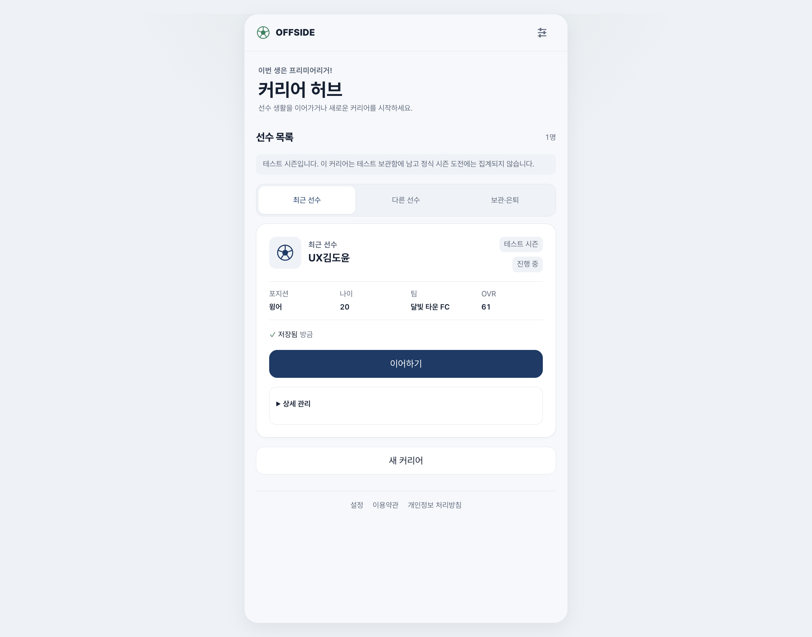
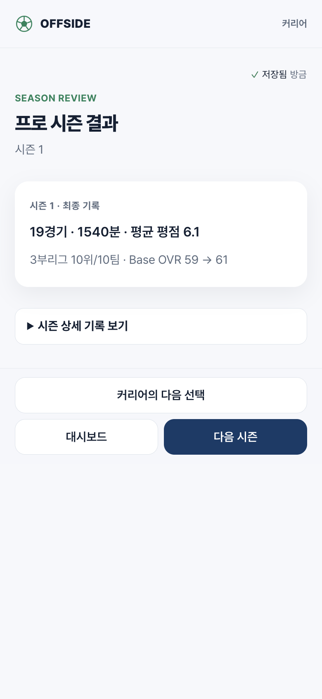

# 오프사이드 앱 경험 전면 개편

작성: 2026-09-06. 기준 main: `bd987e7dc0d821c211f0999d1d2df055b690d196`.
작업 브랜치: `feat/app-experience-redesign`. 이 문서는 운영 배포 승인이 아니다.

## 문제와 목표

실제 모바일 390×844 화면과 구현을 확인했다. 허브에는 브랜드·부제·허브 제목·설명·나의 커리어·최근 선수라는
중복 위계가 있고, 선수 카드 안에 별도 정보 카드와 관리 접기가 쌓인다. 선수 홈에서는 상단 저장 상태,
브랜드 안내, 선수 정보, 탭 사용 설명, 다음 행동 카드가 차례로 공간을 차지한다.

목표는 정보를 삭제하는 것이 아니라 **다음 행동은 즉시 찾고, 자세한 정보는 필요할 때 찾는 구조**다.
첫 사용자와 반복 플레이어의 목적을 나누고, 축구 선수의 현재 상황과 다음 선택에 집중한다.

| Before | After | Why |
| --- | --- | --- |
| 동일한 의미의 제목·설명 반복 | 화면 목적 하나와 핵심 요약 | 처음 읽는 부담 감소 |
| 카드·보조 카드·접기 박스의 중첩 | 섹션 간 여백, 짧은 행, 필요한 카드만 사용 | 중요도 차이를 분명하게 |
| 관리·기술 정보가 플레이와 같은 비중 | 저장 상태는 짧게, 상세 관리·버전은 설정/보조 영역 | 플레이 흐름 보호 |
| 선택·확정·다음 이동의 위치와 표현이 다름 | 상황 → 선택 → 명시적 확정 → 결과 → 다음 흐름 | 행동의 결과 예측 가능 |
| 선택 전 모든 부가 설명을 반복 표시 | 짧은 선택 요약 + 선택된 항목의 세부 맥락 | 비교와 몰입의 균형 |

## 보존 계약

- 선수 ID, 저장 버전, RNG, 게임 규칙, 성장·계약·엔딩 수식, API, OAuth, 운영 DB를 변경하지 않는다.
- 기존 19세 시작, 성별의 능력치 중립, 선호 포지션, 배경과 스타일 선택을 유지한다.
- 선택지 클릭과 명령 확정을 분리한다. 화면 개편 때문에 결과를 재추첨하지 않는다.
- COMMITTING 중 중복 확정과 안전하지 않은 내비게이션을 허용하지 않는다.
- 숨겨진 실패가 없도록 저장 실패·오프라인·충돌은 항상 설명과 복구 동선을 제공한다.
- 삭제는 기존 명시적 확인 절차를 보존한다. 편의성 개선을 이유로 파괴적 동작을 원클릭화하지 않는다.
- 공개 페이지의 실질 내용·canonical·robots·사이트맵 계약을 유지한다. 개인 화면은 계속 검색 제외다.
- Toss UI Kit/폰트/아이콘/토큰을 복사하지 않는다. 자체 디자인과 기존 OFFSIDE 자산만 사용한다.

## 정보 구조

### 첫 방문과 재방문

첫 방문은 간결한 소개와 게임 시작, 저장·복구 안내로 유도한다. 재방문은 최근 선수를 이어가는 것이
가장 명확한 행동이어야 한다. 다른 현역 선수와 은퇴 기록은 분리하되 선택 가능한 위치가 명확해야 한다.
서비스 시즌 정보와 선수의 커리어 시즌을 혼동시키지 않는다.

### 선수 생성

배경 → 선수 정보 → 선호 포지션 → 스타일 → 최종 확인의 전체 위치를 이해할 수 있게 한다.
기존 경로/명령 순서와 임시 입력 보존을 유지한다. 유효성 오류를 필드 가까이 표시하고,
뒤로 가더라도 이미 입력한 내용을 잃지 않는다. 선수 생성 자체에 불필요한 대기 시간을 넣지 않는다.

### 선수 홈과 진행

선수·팀·나이·OVR 및 현재 시즌 맥락을 짧게 보여주고 다음 행동을 강조한다.
일정, 선수 정보, 계약, 기록은 일관된 구역으로 제공한다. 부상·계약 만료 등 현재 의사결정에
직접 영향을 주는 경고는 숨기지 않는다. 실제 저장된 나이·시즌만 표시하고 달력 날짜를 지어내지 않는다.

### 결정과 결과

상황 설명과 선택의 위험·예상 영향은 이해할 수 있게 남긴다. 상세 지표는 선택적으로 열 수 있게 하되,
필수 조건이나 비용을 접어 감추지 않는다. 결과는 무엇이 일어났는지 먼저, 변화량과 이유를 다음에,
다음 행동을 마지막에 표시한다. 계약 검토와 실제 서명은 서로 구분한다.

### 설정

화면/플레이 설정, 계정·동기화·복구, 데이터 관리의 경계를 명확히 한다.
Google 연결이나 복구를 찾기 위해 긴 설정 폼 끝까지 내려가야 하지 않게 한다.
표현 변경이 로그인·복원·삭제의 의미를 바꾸지 않도록 한다.

## 공통 시각·상호작용 기준

- 사용자 확정 방향: **밝고 정돈된 스포츠 앱**. 흰색·옅은 회색 바탕, 네이비 주요 행동, 절제한 그린 포인트를 기본 시각 기준으로 한다.
- 가벼운 중립 표면, 명확한 네이비 계층, 제한된 스포츠 포인트. 라이트·다크 모두 지원한다.
- 저장된 테마·글자 크기·모션 감소 선호를 존중한다. 새 테마를 강제로 덮어쓰지 않는다.
- 본문 가독성을 우선하고, 작은 보조 글자·약한 대비로 정보를 억지로 압축하지 않는다.
- 버튼·탭·선택 영역은 48px 수준의 터치 영역과 눈에 보이는 포커스를 확보한다.
- 모션은 눌림, 화면 위치 변화, 결과 피드백에 제한한다. 반복 행동을 장식 애니메이션으로 지연하지 않는다.
- 다이얼로그는 배경을 약하게 흐리게 하되, 포커스 이동·복귀·Escape·배경 스크롤 제어를 유지한다.
- 탭 전환을 유일한 제스처에 의존시키지 않는다. 스와이프 없이도 모든 화면을 조작할 수 있어야 한다.
- 작은 화면, 긴 이름, 150% 글자 크기, 데스크톱에서도 버튼과 필수 정보가 잘리지 않아야 한다.

## 화면별 범위와 확인 기준

| 화면군 | 작업 범위 | 필수 확인 |
| --- | --- | --- |
| 공통 셸·컴포넌트 | 내비게이션, 타이포, 표면, 탭, 선택 카드, 버튼, 팝업 | 키보드/모션 감소/저장 경고 |
| 공개 소개·온보딩 | 간결한 시작 동선, 읽기 순서 | 기존 시작·복구 경로, SEO 내용 |
| 커리어 허브 | 최근 선수 우선, 현역/은퇴 분리, 보조 관리 | 이어하기 목적지, 삭제 확인 |
| 생성·스타일·확인 | 단계와 선택 위계, 입력 복원 | 19세 시작, 뒤로 가기, 재진입 |
| 선수 홈 | 요약·다음 행동·세부 탭 | 진행/결정 구분, 저장 상태 |
| 프리시즌·시즌 준비 | 계획 입력과 최종 준비 | 선택값 유지, 중복 시작 방지 |
| 이벤트·핵심 경기 | 상황·선택·확정 표준화 | 위험/효과 정보, 결과 재사용 |
| 이벤트·시즌 결과 | 요약 먼저, 이유/상세 다음 | 0/미집계 구분, 다음 동선 |
| 제안·계약·이적 결과 | 조건 스캔과 안전한 결정 | 계약 비용/약속 보존 |
| 은퇴·최종 프로필·Legacy·기록 | 결과 위계와 다시 시작 | 점수/기여·엔딩 유지 |
| 설정·데이터 | 계정/화면/관리 구분 | 복구·Google·삭제 접근성 |

## 검증 방식

운영에서는 개편 전 화면을 읽고 캡처만 했다. 실제 생성·선택·저장은 전용 로컬 DB와
`http://localhost:5190` 웹 / `http://localhost:8790` API에서 확인한다.
로컬 서비스 시즌 `svc_ux_local`은 규칙 1.3.0/콘텐츠 0.5.0을 사용하며 운영 데이터와 분리된다.

전체 테스트를 무작정 늘리지 않는다. 바뀐 컴포넌트와 핵심 행동의 최소 회귀 검사,
타입 검사·lint·빌드, 실제 브라우저 플레이와 화면 캡처를 조합한다.
스크린샷의 픽셀 일치나 CSS 세부값을 고정하는 테스트는 추가하지 않는다.

완료 기록에는 실제 수정한 화면과 공통 스타일만 적용된 화면, 실제 검증한 경로와 미검증 경로를 구분한다.
실기기 터치·가상 키보드 확인은 데스크톱 브라우저 모바일 에뮬레이션과 같은 것으로 주장하지 않는다.

## 구현 및 검증 결과

### 실제 수정 범위

- 공통 토큰·셸·제목·단계 표시·카드·선택·탭·버튼·팝업·저장 상태를 개편했다.
  기본 제목 영역의 축구장 장식과 큰 박스를 없애 선택지에 더 빨리 도달하게 했다.
- 공개 소개, 온보딩, 허브, 생성/스타일/확인/능력치, 설정의 정보 위계를 수정했다.
- 선수 홈, 챕터, 시즌 준비, 이벤트 결과, 시즌 결과, 제안/계약의 구조를 수정했다.
  의사결정에 필요한 부상·다음 사건 정보는 접지 않고 유지한다.
- 프리시즌, 일반 이벤트, 이적 결과, 은퇴/Legacy/최종 프로필 등은 기존 흐름에 공통 디자인을 적용했다.
  이 화면들을 모두 개별적으로 새로 설계한 것은 아니다.
- 게임 전용 CSS는 공통 커리어 레이아웃에서 한 번 로드해 직접 URL 진입과 새로고침에도 적용한다.
- 기존 도메인 이전 안내 배너의 inline 색상을 공통 토큰으로 옮겼다. 안내 내용·링크·복구 로직은 그대로다.

### 확인한 결과

| 검증 | 결과 |
| --- | --- |
| 로컬 새 선수 | 19세, 배경·이름·성별·국적·주발·윙어·스타일 선택 → 확정·복구 안내 → 첫 진로 → 첫 계약 정상 |
| 첫 시즌 | 달빛 타운 FC 계약, 챕터 시즌 시작, 이벤트/경기 선택·결과, 시즌 결산 정상 |
| 실제 결산 표본 | 19경기·1,540분·평균 평점 6.1, Base OVR 59→61, 허브에서 20세로 갱신 확인. QA 표본이지 밸런스 목표가 아님 |
| 결과 상세 | 기본 접힘, 펼치면 상세 기록/OVR 표시, 결과 URL 새로고침 후 정상 복원 |
| 반응형 | 시즌 결과 실제 CSS viewport 360/390/1280px에서 문서 가로 넘침 없음, 데스크톱 셸 560px |
| 글자 확대 | 허브 150%·실제 CSS viewport 360px에서 문서 가로 넘침 없음 |
| 팝업 | 로컬 커리어 삭제의 첫 확인창만 열기. 6px 배경 blur·포커스 진입, Escape 닫기·트리거 포커스 복귀 확인. 실제 삭제 없음 |
| 테마 | 라이트 선택 및 새로고침 유지, 다크 화면과 두 테마 토큰 대비 확인 |
| 자동 회귀 | 변경 화면·생성·저장·모션·계약·결과 관련 11파일 117개 통과; 공통 UI 82개 통과; SEO 3개 통과 |
| 정적 검증 | web/UI 타입 검사, web lint, production build, diff check 통과 |

브라우저의 기존 확대율 때문에 CDP 요청 폭과 CSS viewport가 달랐으므로 `innerWidth`를 실제 검증 기준으로 삼았다.
엔딩까지의 전체 커리어, 모든 포지션·이적 분기, 실기기 가상 키보드, Google 로그인 재인증은 이번 브라우저 재검증 범위가 아니다.
은퇴 화면은 기존 자동 회귀 검사로 확인했다. 기존 빌드의 대형 청크 경고 및 라우트 폴더 테스트 파일 경고는 남아 있다.
운영 DB·API·OAuth·게임 엔진·배포 워크플로 변경은 없으며 main 병합과 배포는 별도 승인 후 진행한다.

### 로컬 캡처

실제 브라우저에서 캡처한 로컬 QA 화면이다. 테스트 선수 외 사용자 데이터나 복구 코드는 포함하지 않는다.

## 추가 요청: 직접 계약 서명

계약 조건을 읽고 직접 서명한 뒤 별도 확정 버튼을 누르는 게임 내 연출을 추가한다.

- 기본 입력은 손가락·펜·마우스 필기다. 선은 입력 위치를 즉시 따라가고 서명 영역에서만 페이지 스크롤을 억제한다.
- 지우기와 다시 쓰기를 지원한다. 빈 서명이나 실수로 찍은 점만으로 확정할 수 없게 한다.
- 그리기가 어려운 사용자는 `이름 입력` 대안을 이용할 수 있다. 키보드만으로도 계약을 완료할 수 있어야 한다.
- 그리기/이름 입력은 계약을 체결하지 않는다. 별도 `서명하고 계약 확정`에서 기존 수락 명령을 실행한다.
- 첫 계약, 재계약, 이적·임대 수락에 적용한다. 도메인에서 계약 변경 없이 처리되는 `INTEREST`의 안전 잔류는 제외한다.
- 제안·계약 조건이 바뀌면 이전 서명을 재사용하지 않는다. 저장 중에는 입력과 중복 확정을 막는다.
- 필기 좌표·입력 이름은 컴포넌트 메모리에만 존재한다. API·DB·분석 이벤트·로컬 저장소로 전송/저장하지 않는다.
  새로고침이나 화면 이탈 시 사라진다는 점을 안내한다. 영구 서명 보관 기능이나 실제 계약용 전자서명 서비스가 아니다.
- 기존 계약 기록, 명령의 중복 방지, 응답 유실 복구, 제안 만료 검증은 유지한다.

### 직접 서명 검증

- 전용 로컬 커리어 `서명테스트`를 생성하고 첫 계약 화면에서 실제 마우스 드래그 및 CDP 터치 입력을 확인했다.
- 필기 뒤에도 revision 9/계약 없음 상태를 유지했다. 지우기·터치 취소·공백 이름은 확정을 허용하지 않았다.
- 이름을 입력하면 확정 가능, 새로고침하면 다시 빈 서명/확정 불가 상태가 됨을 확인했다.
- 터치 필기 후 확정 버튼을 연속 실행해도 revision 9→10, `CONTRACT_SIGNED` 1건만 기록됐다.
- 관련 단위 회귀 4파일 16개를 통과했다(서명 컴포넌트 신규 검사는 2개). 기존 E2E의 서명 진입 경로와
  키보드 전용 흐름을 새 입력 단계에 맞췄으나 이번 작업에서 전체 E2E를 다시 실행한 것은 아니다.
- 터치 에뮬레이션과 마우스는 확인했고 실제 휴대폰·스타일러스 하드웨어 검증은 별도다.
