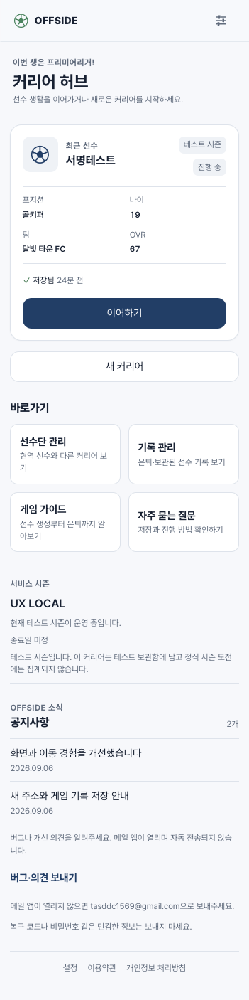

# 홈 허브: 플레이·공지·의견 동선

## 요청과 범위

2026-09-06, [이번 생은 야구다](https://slbcareer.com/)의 실제 홈을
[OFFSIDE 운영 홈](https://offside-lab.com/)과 비교했다. 기준 main은 `53cc46b`(PR #120)이다.
밝고 정돈된 스포츠 앱의 시각 체계와 고정 헤더는 유지하고, 선수 목록 위주인 홈을
플레이·관리·소식·지원의 진입점으로 재구성한다. 없는 기능을 위한 비활성 메뉴는 만들지 않는다.

## 직접 확인한 차이

원작은 현재 커리어의 상태에 따라 이어가기 또는 은퇴 기록 보기와 새 인생 시작을 위쪽에 둔다.
그 아래에는 선수단/팀 관리, 랭킹, 공지 요약, 의견 보내기, 가이드 링크가 이어진다.
공지 전체 보기는 제목·날짜·중요 표시가 있는 모달로 열렸다. 팀 관리·랭킹 등은 관찰만 했으며,
실제 이용 기능을 오프사이드에 구현한다는 뜻이 아니다. 원작에 데이터를 제출하지 않았다.

| Before | After | Why |
| --- | --- | --- |
| 선수 목록과 상태 확인 위주의 허브 | 최근 커리어와 새 커리어를 첫 행동으로 배치 | 반복 방문에서 다음 행동이 명확함 |
| 선수 관리만 탭 안에 위치 | 기존 선수단·보관/은퇴 화면으로 바로가기 | 새로운 관리 시스템 없이 접근성 개선 |
| 테스트 시즌 배너 외 홈 공지 없음 | 실제 시즌 조회 상태 및 배포된 변경 사항 공지 | 운영 소식을 사용자에게 전달 |
| 지원 이메일이 안내 페이지에 위치 | 홈에서 버그·의견 메일 작성 링크와 주소 제공 | 별도 게시판 없이 기존 소통 채널 노출 |
| 안내 링크가 흩어짐 | 기존 게임 가이드·FAQ 연결 | 구현된 도움말 재사용 |

## 적용하지 않는 요소

- 팀 편성/팀 관리, 대전·미니게임, 전체 랭킹, 명예의 전당, 후원 결제: 대응 기능이 없어 생략.
- 게시판·댓글·투표·실시간 이용자 수·허위 후기·준비 중 버튼: 만들지 않는다.
- 원작 로고·문구·서명 이미지·색상 토큰을 복사하지 않는다. 정보 배치와 상호작용 패턴만 참고한다.
- 공지 CMS, 원격 자유 입력 공지 API, 접수 DB, 메일 자동 발송: 이번 범위 밖이다.

## 공지·시즌·문의의 운영 원칙

- 공지는 코드에 있는 정적 데이터다. 제목·게시일·본문 변경은 코드 리뷰와 배포를 거친다.
  운영자가 대시보드에서 즉시 게시할 수 있는 기능으로 설명하지 않는다.
- 이미 배포된 UI/UX 개편, 직접 계약 서명, 고정 헤더와 도메인 안내만 알린다.
  향후 기능/이벤트 일정이나 임의의 출시 버전을 만들지 않는다.
- 시즌 이름·상태·종료일은 기존 `useServiceSeason` 조회를 사용한다.
  로딩/오류를 시즌 오픈으로 간주하지 않고, 종료일이 없으면 미정으로 알린다.
  LOCKED/ARCHIVED의 새 커리어 제한과 기존 커리어 접근 정책은 그대로 둔다.
- 문의는 승인된 `tasddc1569@gmail.com`으로 메일 앱을 여는 링크다.
  전송 완료나 서버 접수 완료를 표시하지 않는다. 메일 앱이 없어도 주소를 볼 수 있다.
  복구 코드·비밀번호 등 민감한 정보를 보내도록 요청하지 않는다.
- 신규 방문의 공개 소개와 온보딩을 보존한다. 기존 진행·Google 연결·저장 데이터는 변경하지 않는다.

## 검증 기준

- 공지 상세 열기/닫기 및 키보드 포커스 복귀, 메일 주소/링크, 가이드/FAQ 이동.
- 최근 선수·선수단·보관/은퇴 deep link 및 브라우저 뒤로가기.
- 신규/빈 허브, 로딩/실패, 시즌 잠금의 기존 생성 제한 유지.
- 좁은 모바일 폭과 150% 텍스트에서 가로 넘침, 고정 헤더와 모달 겹침 확인.
- 관련 화면의 최소 동작 테스트와 타입/lint/build 검증. 운영에서 불필요한 커리어 생성·삭제는 하지 않는다.

Emil 디자인 스킬은 반복 방문에서 불필요한 모션을 줄이고, 기존 버튼·탭·모달의 일관된 반응과
접근성을 유지하는 데 적용한다. ego-browser 스킬로 원작/운영 비교와 로컬 동작 검증을 수행한다.

## 구현과 공지 갱신 방법

- `apps/web/src/routes/index.tsx`: 기본 홈에서는 최근 현역 카드 하나, 이어하기, 새 커리어를 우선 표시한다.
  상세 관리·삭제는 선수단 관리에서 접근한다. `?tab=squad`, `?tab=retired` URL과 관리 탭은 유지한다.
  은퇴 선수만 있으면 현역 없음 상태와 기록 관리 바로가기를 제공한다.
- `apps/web/src/shared/home-community.tsx`: 공지별 독립 Dialog, 메일 링크와 실제 주소를 제공한다.
  공지별 Dialog를 사용해 닫았을 때 해당 공지 버튼으로 포커스가 복귀한다. 자동 팝업은 없다.
- `apps/web/src/shared/home-notices.ts`: `HOME_NOTICES` 배열을 표시 순서대로 관리한다.
  `id`는 고유하게, `date`는 `YYYY.MM.DD`, `title`은 짧은 제목, `body`는 문단 배열로 작성한다.
  새 안내 추가/정정 후 PR과 웹 배포를 해야 사용자에게 반영된다. 문의 이메일도 이 파일을 단일 원본으로 사용한다.
- `apps/web/src/shared/public-content.tsx`: 처음 방문한 사용자에게도 동일 공지·문의 영역을 제공한다.
  기존 소개·가이드·온보딩 흐름과 검색 메타데이터는 보존한다.
- `apps/web/src/shared/home-hub.css`: 기존 시각 토큰을 재사용한다. 공지 제목 옆 닫기 영역 확보,
  좁은 화면의 날짜 줄바꿈, 문의 링크의 48px 터치 영역을 적용한다.

## 검증 결과

- 관련 테스트 22/22: 기존 app-routes 20개 + 신규 공지 상세/포커스 및 문의 링크 2개.
  기존 삭제 테스트 helper만 실제 관리 진입 동선에 맞게 갱신했다.
- web 타입 검사(e2e tsconfig 포함), 변경 TSX ESLint, production build, SEO 3개 검사,
  번들 예산 검사 및 diff check 통과. 기존 라우트 폴더 테스트 파일/대형 청크 경고는 남아 있다.
- 실제 로컬 QA: 최근 카드 1개, 선수단 2개와 상세 관리, 빈 은퇴 기록, URL 전환과 뒤로가기,
  첫 방문의 공지 2개/메일 링크 노출 및 온보딩 진입을 확인했다.
- 공지 첫 항목 열기→Escape→첫 항목 포커스 복귀, overlay z40/header z30 확인.
  CSS viewport 360/390px·텍스트 150%에서 가로 넘침 없음. 공지 닫기 버튼이 화면 안에 있고
  제목과 겹치지 않는다. 텍스트 설정은 검증 뒤 원래 100%로 복원했다.
- 로컬 React Query 캐시에만 LOCKED fixture를 주입해 새 커리어 disabled/이어하기 enabled를
  확인하고 즉시 원래 ACTIVE 값으로 복원했다. DB/서버 시즌은 변경하지 않았다.
- 문의 이메일을 실제로 전송하지 않았으며, 운영 사용자 커리어 생성·삭제·게임 선택도 수행하지 않았다.
  전체 엔딩 재플레이/실기기 메일 앱/모든 시즌 오류 상태의 브라우저 재현은 이번 검증 범위가 아니다.

캡처는 로컬 테스트 시즌이며 `UX LOCAL`과 테스트 선수만 포함한다. 운영 시즌명은 실제 API 조회값으로 표시된다.
