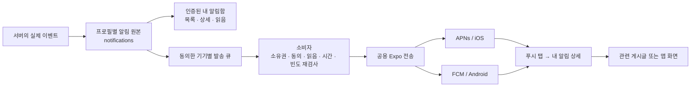

# 개인 알림함과 앱 재방문 푸시

T-11-099의 구현과 운영 도입 기록이다. 2026-10-05 운영 DB/API/웹과 iOS·Android OTA를 배포했다. 개인 자동 발송 플래그는 OFF이며, 실기기 APNs/FCM 수신 검증은 남아 있다.

2026-10-05 사용자 요청으로 [푸시 로고 정비와 스토어 심사 준비](push-logo-store-review.md)는 별도 작업으로 분리했다. Android 전용 알림 아이콘과 이전 v6 생성 스크립트 정리는 해당 작업에서 진행하며, 이 기능 변경에서 앱 버전·아이콘·runtime을 바꾸지 않는다.

## 2026-10-05 현황 보고

- 기존 공지/릴리즈 푸시와 일반 사용자 본인 테스트 발송 경로는 main/운영 배포에 포함되어 있다. 테스트 공개·제한 PR #498은 `763eee99`로 머지됐다. 최신 main `3abd99e9`의 [운영 배포 37286553391](https://github.com/tasddc1226/offside-football-simulator/actions/runs/37286553391)은 API/웹 배포·태그·앱 OTA·릴리즈 게시 잡이 성공했다. 운영 `/v1/health`도 200을 확인했다. 이 기록은 개별 기기의 수신·표시 증거가 아니다.
- T-11-099의 개인 알림함, 기존 공지/테스트의 알림함 기록, 홈 7일 보류, 개인 발송 큐와 7일 미방문 생산자를 [PR #505](https://github.com/tasddc1226/offside-football-simulator/pull/505)로 main `feac071859a9912d2789ce0f77fc380c9ea7654b`에 병합하고 운영 배포했다. 개인 자동 발송 플래그는 OFF를 유지한다. 아래 운영 배포 기록에 검증 범위와 남은 실기기 확인을 구분했다.
- 공지 푸시는 공지 게시판의 KST 당일 첫 신규 글, 릴리즈 푸시는 릴리즈 게시판의 당일 첫 신규 글에만 생성한다. 각각 게시판별 하루 한 번이다. 저장 직후 발송을 시도하고 기존 5분 cron이 미처리 발송을 이어 처리한다. 글 수정·당일 추가 게시·과거 글·단순 재배포로 추가 푸시하지 않는다.
- 테스트는 앱 설정에서 사용자가 요청한 현재 기기로 즉시 발송을 시도한다. 서버가 기기와 프로필에 10분 간격·KST 하루 3회 한도를 적용한다. 제한에 걸려 거절된 요청은 알림함 기록도 만들지 않는다. 제한을 통과한 요청은 실제 전송 전에 본인 알림함에 저장하므로 전송 실패 때도 기록이 남을 수 있다.
- 재방문은 기기 등록 갱신을 근거로 7~90일 비활성인 별도 동의 사용자를 대상으로 한다. 다른 기기가 최근 7일 활성 상태면 제외한다. 운영 플래그를 켜야 생성/발송하며, 같은 비활성 구간에 한 번, 최근 재방문 안내 이후 최소 7일 간격을 둔다. KST 09:00~20:00 미만에 처리하고 알림 상세에서 홈으로 이동한다. 실제 방문 시각과 약 하루 오차가 있을 수 있다.
- KST 주간 시간·프로필당 1시간 간격/하루 2개 제한은 개인 자동 큐에만 적용된다. 공지·릴리즈와 사용자가 요청한 테스트에는 해당 시간 제한을 적용하지 않는다.
- 경기 결과·카드 판매 완료·친구 신청/수락은 후속 연결 설계 상태이며, 현재 해당 이벤트로 푸시가 나가지 않는다.
- 사용자 화면은 Android/iOS 앱 전용이다. 웹에는 알림함·푸시 설정·웹 푸시를 추가하지 않았다. 서버 알림함 API는 본인 프로필 인증으로 보호되지만 앱 채널만으로 제한하지는 않았다.

## 현재 구현 범위

- 홈의 종 버튼과 설정의 알림함 진입, 전체/미읽음 목록, 상세, 개별/모두 읽음, 관련 내용 이동. 목록은 20개 단위의 `(created_at, id)` 커서로 불러온다.
- 알림은 프로필별로 90일 보관한다. 목록·상세·쓰기 모두 서버 세션의 프로필만 사용하며 `no-store`다. 다른 계정의 ID는 존재하지 않는 ID와 같은 404다.
- 앱 캐시는 현재 세션의 메모리에만 5분간 둔다. 토큰 변경 때 캐시와 이전 응답을 버린다. 홈에서 알림 목록을 요청하거나 폴링하지 않는다. 종의 숫자는 마지막 조회 결과이며 실시간 전체 미읽음 수를 보장하지 않는다.
- 푸시 탭은 검증된 알림 ID로 상세를 연다. ID가 없는 이전 공지 푸시는 기존 게시글 이동을 유지한다. 임의 URL·게임 명령은 받지 않는다. 읽음은 상세를 연 뒤 서버 요청 성공 때 기록한다.
- 공지·릴리즈의 기존 발송 수신자에게 원본 이벤트별 알림 하나를 저장한다. 여러 기기로 받아도 원본은 하나다. 알림 끈 사용자에게 모든 게시글을 배포하는 기능은 아니다. 이전 발송 내역을 소급 생성하지 않는다.
- 수동 본인 테스트도 원본을 남기고 ID를 페이로드에 넣는다. 요청 기록은 실제 기기 수신을 증명하지 않는다. 기존 10분/하루 3회 제한과 현재 기기로만 보내는 동작을 유지한다.
- 최초 홈 안내의 ‘나중에’는 기기에 7일 보류한다. 명시적인 권한 거부·설정에서 끄기·이전 버전의 종료 기록은 다시 안내하지 않는다.

## 발송 경계와 운영 제어

`queueNotification`은 서버 전용 생산자다. `(profile_id, source_key)`로 원본과 발송을 중복 생성하지 않는다. 기기는 이벤트 생성 시점에 스냅샷을 잡고 발송 직전에 다시 검사한다. 계정/토큰 전환, 만료 세션, 탈퇴, 동의 해제, 이미 읽음에는 새 발송을 취소한다. 늦은 토큰 오류가 새 등록을 지우지 않도록 등록 스냅샷으로 삭제한다.

개인 이벤트 큐 `push_deliveries`는 기존 공지 큐와 분리한다. 기존 5분 cron에서 한 번에 최대 100개씩, 발송 최대 3묶음과 영수증 1묶음을 처리한다. lease로 동시 소비를 막는다. 429/5xx/명시적인 속도 오류는 최대 4번 재시도하며, 타임아웃·깨진 응답·중단된 발송은 `unknown`으로 남기고 재발송하지 않는다. 접수 후 15분 간격으로 영수증을 확인한다. 종료된 큐의 토큰은 비우고 큐는 만료 30일 뒤 정리한다. 본문·토큰·사용자 ID를 발송 로그에 쓰지 않는다.

| 제어                | 현재 기본안                                                                               |
| ------------------- | ----------------------------------------------------------------------------------------- |
| 서버 전체 개인 발송 | `PERSONAL_PUSH_ENABLED=1`과 production일 때만 동작. 미설정은 OFF                          |
| 재방문 후보 생성    | 위 조건과 `REENGAGEMENT_PUSH_ENABLED=1`이 모두 필요. 미설정은 OFF                         |
| 사용자 선택         | 새 설정 ‘재방문 안내 (선택)’, 기기별 `engagement_enabled`, 기본 OFF. 기존 앱 등록은 false |
| 개인 자동 발송 시간 | KST 09:00 이상 20:00 미만. 영수증 확인은 야간에도 가능                                    |
| 개인 이벤트 빈도    | 프로필당 1시간 간격·하루 최대 2개의 신규 원본. 여러 기기/재시도는 예산 하나 공유          |
| 초과 이벤트         | 푸시는 취소하고 알림함 원본은 유지                                                        |
| 발송 유효기간       | 원본 생성 후 24시간, 전송 메시지 TTL 1시간                                                |

공지의 ‘게시판마다 하루 한 번’, 수동 본인 테스트의 ‘10분/하루 3회’는 기존 별도 한도다. 위 2회는 **개인 자동 이벤트만의 한도**로 전체 푸시 합계 한도는 아니다. 개인 플래그를 꺼도 알림함 조회·읽음과 기존 공지·수동 테스트는 동작한다.

기본 OFF는 시험 없이 대량 발송을 시작하지 않기 위한 도입 상태다. 이번 운영 배포에서도 `PERSONAL_PUSH_ENABLED`·`REENGAGEMENT_PUSH_ENABLED`는 미설정 OFF를 유지했다. 기존 공지·수동 테스트의 활성 설정은 유지했다. 후속 활성화 때 대상 플래그를 Wrangler 설정에 함께 반영한다.

## 트리거 설계

| 이벤트                 | 대상과 타이밍                                           | 중복 키와 이동                   | 상태                                         |
| ---------------------- | ------------------------------------------------------- | -------------------------------- | -------------------------------------------- |
| 새 공지/릴리즈         | 기존 동의 기기, 게시판의 당일 첫 신규 글                | 게시판+KST 날짜 → 해당 게시글    | 연결 완료                                    |
| 수동 본인 테스트       | 사용자가 직접 요청한 현재 기기                          | 테스트 요청 시각 → 홈            | 연결 완료                                    |
| 7일 미방문             | 별도 동의한 유효 앱 기기, 다른 기기도 최근 7일 비활성   | 마지막 등록 갱신 시각 → 홈       | 후보 생성/발송 모듈 완료, 운영 OFF           |
| 내 팀의 수동 도전 결과 | 도전 완료 저장 트랜잭션에서 해당 팀 소유자에게 결과 1회 | 경기 ID+대상 프로필 → 팀 화면    | 후속 기능 연결안                             |
| 내 카드 판매 완료      | 거래 확정 때 판매자, 아직 읽지 않은 결과만              | 판매 ID+판매자 → 이적시장        | 후속 기능 연결안                             |
| 친구 신청/수락         | 관계 상태가 실제 변경된 때 대상 사용자, 취소/중복 방지  | 관계 ID+상태+대상 → 팀/친구 화면 | 후속 기능 연결안, 별도 친구 작업과 조정 필요 |

7일 미방문은 정밀한 방문 로그 대신 기존 기기 등록 갱신(최대 하루 1회)을 사용하므로 실제 마지막 방문과 최대 약 하루 차이가 날 수 있다. 동일 비활성 구간은 한 번만 생성하고, 새 구간도 최근 7일 안에 재방문 알림이 있으면 생성하지 않는다. 발송 전 앱에 돌아온 기기가 있으면 취소한다. 후보 100명과 기기 큐를 한 D1 batch로 저장하며 프로필마다 추가 요청하지 않는다.

기능 이벤트는 화면 진입·주기 조회에서 생성하지 않는다. 실제 성공한 서버 쓰기와 원본/큐 저장을 같은 트랜잭션으로 결합한다. 경기·거래·친구 기능의 본래 자격과 부작용을 바꾸지 않는다. 새 이벤트 종류마다 별도 동의/우선순위와 하루 한도의 포함 여부를 검토한다. 현재 타깃은 안전한 화면/공지 링크만 허용하므로 엔티티 상세 이동은 해당 권한 검사와 계약을 추가한 뒤 제공한다.

## 도입 검증과 측정

1. 마이그레이션을 로컬 D1에 적용하고 사생활 분리, 재시도, quiet hours, 한도, 계정 변경을 확인한다.
2. iOS/Android에서 목록·상세·미읽음·관련 내용 이동, 작은 화면·안전 영역을 확인한다.
3. 테스트 계정의 물리 기기에서 APNs/FCM 실제 수신 및 앱 종료/배경 상태의 탭 이동을 확인한다. 시뮬레이터, Expo 접수와 영수증만으로 이를 완료했다고 하지 않는다.
4. 운영 도입 시 기존 Expo 프로젝트, APNs/FCM 자격증명, runtime/OTA 호환성, 테스트 대상과 플래그를 확인한다. 새 네이티브 의존성을 추가하지 않았다.
5. 기존 분석 동의를 따르는 `알림함 열기 → 상세 보기 → 관련 내용 이동 → 실제 재참여` 퍼널을 후속 측정한다. 원문/ID/개인 정보를 분석 이벤트에 넣지 않는다. 현재 변경은 새 분석 이벤트를 수집하지 않는다.

`accepted`는 Expo 접수, `confirmed`는 전달 영수증, 읽음은 앱 상세 열기다. OS 표시, 푸시를 누른 앱 방문, 게임 재참여/유지율은 서로 다른 지표다. 운영 activation 전에 억제·실패 비율과 실제 기기 수신을 먼저 확인하고, 이후 사용자별 빈도와 문구를 조절한다.

### T-11-099 로컬 검증 기록 (2026-10-05)

- 격리된 로컬 D1에 푸시 마이그레이션까지 적용, 로컬 API health 정상.
- 알림함/개인 큐 집중 14건, 기존 등록/테스트·공지 소비자·마이그레이션 40건, 릴리즈 게시 저장 12건 통과.
- 공용 알림함 상태/캐시 6건, 모바일 알림·동의 어댑터 29건, 릴리즈 게시 스크립트 6건, 정적 정책 페이지 생성 회귀 9건 통과.
- API·app-core·mobile 타입 검사, 변경 파일 ESLint, iOS/Android Expo export 통과.
- iOS 테스트 시뮬레이터에서 개발 바이너리 실행 및 현재 JS 번들 로드. 복사한 기존 바이너리의 알림 Keychain 접근 오류가 있어 기기 등록 검증 증거로 사용하지 않음.
- 컴퓨터 제어 도구가 Simulator 접근을 승인하지 않아 실제 화면 조작·좁은 화면 검증 미완료. Android 테스트 환경 준비를 시도했으나 ADB 설치/부팅 응답이 지연되어 실행·화면 검증 미완료. 이 작업에서 띄운 Android 프로세스는 정리함.
- 운영 마이그레이션, CI 전체 검사, main 머지, 배포 및 물리 기기 수신 검증은 하지 않음.

2026-10-05 운영 배포 준비에서 최신 main의 기존 0061(친구)·0062(성장 기록 보관)를 보존하고 푸시 변경을 `0063_push_inbox.sql`로 재생성했다. SQL은 이전에 집중 검증한 푸시 변경과 동일하다.

### 운영 배포 준비 중 추가 검증

- iOS Simulator 제어 접근이 정상화되어 격리된 Push Inbox QA 기기에서 최신 로컬 번들을 확인했다. 홈 종 버튼, ‘나중에’ 후 안내 숨김, 빈 알림함, 테스트/재방문 종류 표시, 상세 진입에 따른 읽음·개수 갱신, 미읽음 필터, 모두 읽음, 상세에서 홈 이동과 설정의 알림함 진입을 확인했다. 작은 화면에서 버튼 문구가 가독성과 안전 영역을 유지하는 것도 확인했다.
- 실제 화면 확인에서 뒤로 가기·미읽음 버튼의 문자열/숫자 혼합 children이 기본 버튼의 Text 래핑을 통과하지 못하는 문제를 발견해 단일 문자열로 수정했다.
- 위 목록/상세 데이터는 격리된 로컬 DB의 QA 원본이다. 실제 외부 푸시 전송·APNs/FCM 수신을 검증한 것은 아니다. 기존 시뮬레이터 디버그 바이너리의 알림 Keychain 오류는 남아 있다.
- 로컬 전체 API 실행에서 localhost 연결 `EADDRNOTAVAIL` 실패가 발생했다. 단일 worker로 일일 정리·알림함·팀/친구 집중 56건은 통과했다. 운영 배포 전에는 최신 커밋의 전체 CI 결과를 확인한다.
- 현재 production 환경으로 계산한 iOS `55f5823c`·Android `f527ee4f` runtime은 각각 완료된 production 1.1.0 빌드 12와 일치한다. 앱 버전·네이티브 설정을 바꾸지 않고 호환 OTA로 전달할 수 있다.

### 운영 배포 기록 (2026-10-05 20:06 KST)

- [필수 CI 37299171628](https://github.com/tasddc1226/offside-football-simulator/actions/runs/37299171628) 성공 후 PR #505를 병합했다. 전체 형식·린트·타입·테스트와 시뮬레이션 검증, API 513건, E2E 178건과 분석 동의 E2E 10건을 통과했다.
- main `feac0718`의 [운영 배포 37300159276](https://github.com/tasddc1226/offside-football-simulator/actions/runs/37300159276)은 DB/API/웹, 양 플랫폼 OTA, 릴리즈 태그와 사용자 안내 게시가 모두 성공했다. 태그는 `v2026.10.05.20`이다.
- 복구 북마크와 마이그레이션 전후 집계를 배포 아티팩트에 보관했다. `0063_push_inbox.sql`을 적용했고 운영 테이블은 36개에서 38개로 늘었다. 기존 집계 대상의 건수 감소는 없었으며, 운영 트래픽 때문에 일부 증가했다.
- 운영 API read-back: health 200, 인증 없는 알림함 401, 새 익명 앱 세션의 본인 알림함 200/빈 목록/`private, no-store`, 없는 알림 상세 404. 실제 외부 푸시나 사용자 알림을 생성하지 않았다.
- iOS production OTA 그룹 `abe152b1-5dd8-4cae-b314-55cf66043ae6`, 업데이트 `01a10bbc-c8de-78b2-aac6-34def5299a45`, runtime `55f5823c8cb4c8b7476a9836552fcb233fca32f7`.
- Android production OTA 그룹 `c5bdac76-4beb-4f76-9512-bcd7b48049dd`, 업데이트 `01a10bbd-d6c1-77a0-bad6-1e6128552586`, runtime `f527ee4f7f00bc3d64540ebf4fd76b70f79676c2`.
- 두 OTA의 게시 커밋은 `feac0718`이며 production manifest read-back에서도 해당 업데이트 ID/runtime을 확인했다. 사용자 릴리즈 게시글 `pst_release_20261005`에 앱 전용 알림함 항목이 반영된 것도 확인했다. 설치된 앱의 OTA 적용·OS 알림 표시를 검증한 기록은 아니다.
- iOS 로컬 화면 조작은 완료했다. Android 실행 기기는 없었고, 실기기 APNs/FCM 수신·푸시 탭 이동은 미확인이다. 재방문 자동 발송은 이를 확인한 뒤 별도 활성화한다. 푸시 로고와 스토어 빌드·심사는 별도 작업으로 유지한다.
