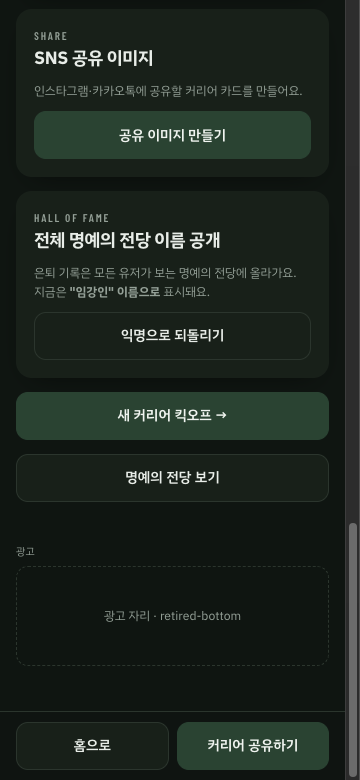
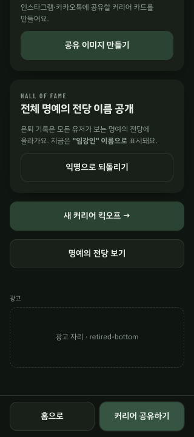

# T-11-108 은퇴 결과 광고 확인

2026-10-05, 원격 main `0930cf7ab964fb2dbdfa236ed92cecd091d77c8a` 기반 로컬 검증이다.

## 모바일 웹

개발 서버 `VITE_ADSENSE_PREVIEW=1`의 자리 표시로 확인했다. API는 연결하지 않고 로컬 테스트 세이브에서
선수 생성 → 이적 시장 → 은퇴 → 화면 하단 스크롤 → 새 커리어 버튼 순서로 진행했다.
실제 광고 스크립트 요청은 0건이다.

| 화면 | 확인 결과 |
| --- | --- |
| 360 × 780 | 은퇴 광고 1칸, 명예의 전당 버튼과 광고 사이 42px, 광고 하단 666px / 고정 공유 바 시작 711px |
| 320 × 720 | 가로 넘침 없음(문서 폭 320px), 새 커리어 버튼 높이 48px, 광고 하단 606px / 공유 바 시작 651px |
| 새 커리어 이동 | 배너를 기다리지 않고 생성 화면 진입, 은퇴 광고 칸 제거 |

## 검증

- 웹·앱 typecheck 및 변경 코드 ESLint 통과
- 공용 광고 정책 3건 통과(최초 요청, 5분 경계, 미채움 재요청 방지, 위치표 전체 순회)
- 기존 웹 e2e 3건 통과(공유 링크 복사·하단 버튼, 은퇴 기록 재접속, 잠재력 없는 옛 기록)
- 웹 production build, 변경 파일 서식, 릴리즈 노트 형식, 공개 저장소 위생 검사 통과
- 초기 e2e 실행은 다른 검증 서버와 포트가 겹쳐 무효였다. 별도 빈 포트의 본 작업 서버에서 위 3건을 재검증했다.

## 확인 한계

네이티브 앱은 타입·정적 검사만 수행했다. iOS/Android에서 배너 수신, UMP 동의, 광고 제거 구매,
하단 스크롤 도달 계측은 이 PR의 실제 네이티브 빌드에서 아직 확인하지 않았다.
전체 테스트·CI 결과, 운영 광고 노출·수익은 이 기록에 포함하지 않는다.
웹 실노출에는 `VITE_ADSENSE_SLOTS`의 `retired-bottom` 단위 설정과 승인된 광고 공급이 필요하다.
머지·운영 배포·광고 계정 설정은 수행하지 않았다.
